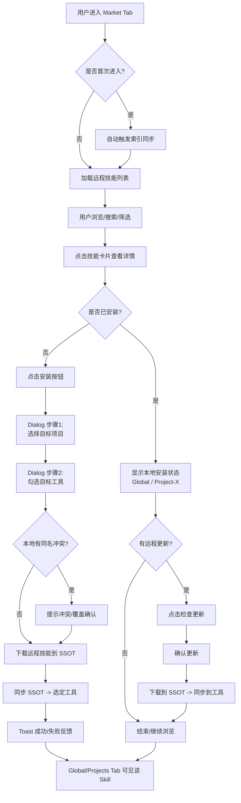

# Skill Manager 产品需求文档

## 目录

- [1. 产品概述](#1-产品概述)
- [2. 目标用户](#2-目标用户)
- [3. 核心问题](#3-核心问题)
- [4. 范围](#4-范围)
- [5. 功能需求](#5-功能需求)
- [6. 非功能需求](#6-非功能需求)
- [7. 同步触发机制](#7-同步触发机制)
- [8. 技术架构](#8-技术架构)
- [9. 数据模型](#9-数据模型)
- [10. 约束条件](#10-约束条件)
- [11. 未实现功能](#11-未实现功能)
- [12. 验收检查清单](#12-验收检查清单)
- [13. 验收用例](#13-验收用例)
- [14. 路径解析边界情况](#14-路径解析边界情况)
- [15. 错误处理策略](#15-错误处理策略)
- [16. UI 交互规范](#16-ui-交互规范)
- [17. 技术方案评审](#17-技术方案评审)
- [18. 开发里程碑](#18-开发里程碑)
- [附录 A：术语表](#附录-a术语表)
- [附录 B：参考资料](#附录-b参考资料)
- [附录 C：PRD 变更日志](#附录-cprd-变更日志)

## 1. 产品概述

Skill Manager 是一款桌面应用，用于统一管理 AI 编码工具（Claude Code、Codex CLI、OpenCode、Gemini CLI、Cline 等）的 Skill 插件。它以 `SSOT`（Single Source of Truth，单一信息源）管理 Skill 文件，并同步到多个工具目录，解决“同一个 Skill 需要手动复制到多个工具目录”的问题。

**一句话定位**：一处管理，多处生效的 AI Skill 同步中心。

## 2. 目标用户

日常使用多个 AI 编码助手的开发者。他们通常会在 2-5 个 AI 工具之间切换，并沉淀自己的 Skill 库；但不同工具的 Skill 目录不同，手动同步繁琐且容易遗漏，最终造成版本不一致。

## 3. 核心问题

开发者在多个 AI 编码工具中使用基于 `SKILL.md` 的插件，但各工具有独立 Skill 目录，例如 `~/.claude/skills/`、`~/.codex/skills/`。同一份 Skill 更新后，需要逐一复制到多个位置，容易遗漏并产生版本分叉。

## 4. 范围

当前版本已超出原始 MVP，完成度见 [§18 开发里程碑](#18-开发里程碑)。核心价值仍为：扫描发现 → 集中展示 → 一键同步，并新增远程 `Market`、应用内更新、首次启动引导、健康检查等能力。

**已实现：**

- 本地路径扫描
- Skill 列表展示
- 启用/禁用控制
- `SSOT` 同步
- 全局与项目两级管理
- 冲突检测与裁决
- 差异预览
- 变更忽略
- 远程 `Market`
- 应用内更新
- 首次启动引导
- Skill 健康检查 / Lint
- 内置 `SKILL.md` 编辑器
- 活动日志

**未实现（计划中）：**

- 文件系统监听自动同步
- 时间戳驱动同步 UI
- `MCP` 集成
- 除 GitHub 外的其他代码托管平台适配

## 5. 功能需求

### 5.1 工具路径配置

用户可对各 AI 编码工具的 Skill 目录进行增、删、改。配置分两级：

- **全局路径**：预设各工具的常见默认路径，例如 `~/.claude/skills/`，用户可覆盖。
- **项目路径**：留空时按 `<项目根目录>/<工具的相对路径>` 推断；用户手动填写时，以自定义值为准。

路径变更后，应用立即触发对应范围的重新扫描。

**验收标准：**

- 13+ 个预设工具各自有正确默认路径。
- 用户可修改任意工具的全局路径和项目相对路径。
- 修改路径后自动触发扫描，无需手动操作。
- 支持自动发现已安装但未注册的工具。

### 5.2 路径格式容错

支持以下路径格式，并正确解析为绝对路径：

- `~/.claude/skills/`
- `C:\Users\xx\.claude\skills\`
- `/home/xx/.claude/skills/`

路径末尾有无斜杠均可。路径不存在时给出明确错误提示，不崩溃。

**验收标准：**

- `~` 正确展开为用户主目录。
- Windows 反斜杠和 Unix 正斜杠均可处理。
- 不存在的路径显示红色提示：“路径不存在”。

### 5.3 递归扫描 `SKILL.md`

应用对每个配置的工具路径递归扫描目录树。找到 `SKILL.md` 后，解析其 YAML front matter，提取 `name` 和 `description`，并将 `SKILL.md` 所在目录整体识别为一个 Skill；命中后停止扫描该目录的子目录。未命中的目录继续递归。

同一路径重复扫描时，以 `source_path` 去重。同名 Skill 跨工具合并为一条记录，多份安装。

**扫描算法：**

```text
function scan(dir):
    if dir contains "SKILL.md":
        parse front matter -> {name, description}
        compute content_hash(dir)
        register skill(source_path=dir)
        return  // 不再深入子目录

    for subdir in dir.children:
        if subdir is directory and not hidden:
            scan(subdir)
```

**`content_hash` 计算：** 递归遍历目录下所有非隐藏文件，跳过 `local.md`；按相对路径字典序排列，以 `"相对路径\0内容\0"` 依次喂给 SHA-256，输出完整哈希字符串，用于全量 diff 展示。

**`core_hash` 计算：** 仅对 `SKILL.md` 计算 SHA-256，用于冲突检测和核心内容比对。附属文件（`assets/`、`references/` 等）变更不影响 `core_hash`。

**验收标准：**

- 能正确发现嵌套目录中的 `SKILL.md`。
- 隐藏目录（以 `.` 开头）跳过不扫描。
- front matter 解析失败时跳过该目录并记日志，不崩溃。
- `SKILL.md` 存在但 front matter 缺少 `name` 字段时，以目录名作为 fallback name。
- 同名 Skill 跨工具合并为一条记录。
- `content_hash` 和 `core_hash` 能正确检测内容变化。
- `description` 被正确解析并展示。

### 5.4 数据库存储

应用使用 SQLite 嵌入式数据库。当前核心数据表共 9 张，开启外键约束并支持级联删除。

**ID 哈希方案：** 取目标字符串的 SHA-256，截取前 8 字节，按 little-endian 解析为有符号 64 位 `INTEGER`。映射表（`skill_installations`、`sync_logs`）使用自增 ID。

| 表 | 说明 |
|----|------|
| `tools` | 工具注册表，存储 AI 工具名称和路径配置。ID 为工具名称哈希。 |
| `projects` | 用户手动添加的项目。ID 为项目绝对路径哈希。内置全局项目：`id=0, name="Global"`。 |
| `skills` | Skill 元数据。唯一约束为 `(name, project_id)`，包含 `content_hash`、`core_hash`、`ssot_updated_at`、`source_market_id` 等字段。 |
| `skill_installations` | Skill 与工具的多对多安装关系，通过 `project_id` 区分全局和项目级。唯一约束为 `(skill_id, tool_id, project_id)`，状态为 `active` / `disabled`，包含 `installation_synced_at`。 |
| `sync_logs` | 同步日志。每次同步操作记录方向（`to_ssot` / `from_ssot`）、状态（`success` / `failed`）和错误信息。 |
| `dismissed_updates` | 变更忽略记录。用户忽略某工具变更后，hash 匹配时不再提示。 |
| `markets` | 市场源。记录远程 GitHub 仓库配置，含 `provider`、`owner`、`name`、`branch`、`enabled`、`layout` 等字段。 |
| `remote_skills` | 远程技能元数据，包含 `remote_content_hash`、`remote_core_hash`、`is_installed` 等字段。 |
| `remote_installations` | 远程技能与项目的安装关系，支持 `scope`（`global` / `project`）和 `active` 状态。 |

**验收标准：**

- 应用重启后数据完整可读。
- 级联删除正常工作。
- ID 哈希计算正确且一致。

### 5.5 `SSOT` 同步与反向同步

`SSOT` 按 `(name, project_id)` 域隔离：

- 全局域：`~/.skill-manager/ssot/<name>/`
- 项目域：`~/.skill-manager/ssot/_p<project_id>/<name>/`

**同步流程：**

1. 工具目录 → `SSOT`：扫描发现变化后，用户点击“同步”，应用复制到 `SSOT`。
2. `SSOT` → 工具目录：应用从 `SSOT` 分发到所有启用的工具目录。

**反向同步：** 用户可将 `SSOT` 内容推送到指定工具目录，覆盖该工具中的本地更改。

**文件操作规范：**

- 复制使用标准库 API，不使用 shell 命令。
- 替换使用临时目录（`.tmp-{进程ID}-{纳秒时间戳}`）+ rename 原子操作。
- Symlink 失败时回退到 Copy，并记录日志。

**`local.md` 标记机制：** `SSOT` 目录下保留 `local.md`，语义为“此目录由 Skill Manager 管理”。`hash.rs` 和 `diff.rs` 计算 hash 时跳过 `local.md`。

**验收标准：**

- 扫描到变化后，UI 正确标记。
- 点击同步后，`SSOT` 和所有目标工具目录内容一致。
- 同步前后 `content_hash` 一致。
- 反向同步可覆盖工具本地更改。

### 5.6 Skill 可视化列表

主界面展示所有已发现的 Skill，支持卡片/列表两种视图。每个 Skill 展示名称、描述、来源路径、已安装工具数、`SSOT` 更新时间。用户可启用/禁用某个 Skill 到某个工具；禁用后不再同步到该工具。列表在扫描完成后自动刷新，并支持搜索、排序、筛选。

**验收标准：**

- Skill 卡片正确显示 `name`、`description`、来源路径。
- 启用/禁用切换立即生效。
- 扫描完成后列表自动更新。
- 支持搜索和排序。

### 5.7 全局与项目两级管理

界面顶部有 `Global`、`Projects`、`Market` 三个一级 Tab。`Global` 管理全局 Skill。`Projects` 左侧显示用户手动添加的项目列表，右侧与全局界面同构。

项目级安装的 Skill 不反向共享到全局或其他项目。项目级与全局的关联体现在工具路径继承和 Skill 安装独立性上。

**验收标准：**

- `Global`、`Projects`、`Market` Tab 切换正常。
- 项目可手动添加、删除、编辑。
- 项目级 Skill 不影响全局。
- 远程 `Market` Skill 可浏览、安装、同步。

### 5.8 操作反馈

所有用户操作（扫描、同步、安装、配置）结束后有明确反馈。成功时显示绿色提示，并包含数量统计，例如“扫描完成，发现 3 个 Skill”；失败时显示红色错误详情。反馈停留至少 3 秒，或可在消息中心查看。

**验收标准：**

- 每次操作都有视觉反馈。
- 成功/失败样式明确区分。
- 反馈信息包含具体数据（数量、名称等）。

### 5.9 Skill `Market`（远程仓库）

用户可从远程仓库浏览、搜索、一键安装 Skill。支持四家托管平台，统一走 `providers.rs` 的 `MarketProvider` seam：GitHub、GitLab（含自建实例，主机地址随 `markets.remote_url` 落库）、Bitbucket Cloud、Azure DevOps（私有组织需环境变量 `AZURE_DEVOPS_PAT`，不落盘）。应用内置 5 个默认市场源，并支持用户添加自定义仓库。

**核心能力：**

- 市场源管理：添加、删除、启用、禁用、同步索引。
- 技能浏览：卡片网格、搜索、按市场筛选。
- 引导式安装：用户选择目标项目与目标工具，应用依次执行“下载到 `SSOT` → 同步到工具”。
- 批量操作：全部扫描、全部标记已安装、全部取消标记、同步所有已安装。
- 更新检测：检查远程仓库 commit 变化，并提示可用更新。

**验收标准：**

- 内置市场源自动 seed。
- 可浏览、搜索远程技能，并引导式安装到指定项目/工具。
- 安装前检查本地同名 Skill 冲突，提示用户确认覆盖或跳过。
- 支持批量操作。

### 5.10 `Market` 用户体验流程

`Market` Tab 是 `Global` / `Projects` 之外的第三级管理入口，承载远程技能的发现、安装与维护。完整流程分为六个阶段。

#### 5.10.1 进入与初始化

用户点击顶部 `Market` Tab 进入。若为首次进入且远程索引未同步，应用自动静默触发一次索引同步；若网络不可用，显示降级提示：“当前离线，仅展示缓存内容”，并提供“重试”按钮。

#### 5.10.2 浏览与发现

卡片网格展示所有已同步的远程技能。顶部提供搜索框（按名称/描述过滤）和市场源下拉筛选。每张卡片展示技能名称、描述、所属市场源、安装状态指示器（未安装 / 已安装-Global / 已安装-Project-X / 有更新）。

#### 5.10.3 详情查看

点击卡片后展开详情面板，展示完整 `description`、远程仓库链接、文件结构预览、本地安装状态（已安装到哪些项目/工具），以及远程版本与本地版本的 hash 对比。

#### 5.10.4 安装决策

用户点击“安装”按钮后，应用触发引导式 Dialog：

1. 选择目标项目（`Global` / 具体项目）。
2. 勾选目标工具（多选，默认选中当前项目下所有启用工具）。
3. 前置检查：若本地 `Global` 已有同名 Skill，弹出确认：“本地已存在同名 Skill，是否覆盖？”
4. 确认后执行：下载远程技能到 `SSOT` → 同步 `SSOT` 到选定工具目录。
5. 完成后 Toast 反馈成功/失败，包含技能名称与目标项目。

#### 5.10.5 批量操作

`Market` 顶部提供批量操作入口：

- **全部同步索引**：调用 `sync_all_market_indices` 同步所有 enabled 的市场源索引。
- **全部标记已安装**：将所有 `remote_skills.is_installed` 设为 `true`，仅影响 UI 关注标记，不触发实际同步。
- **全部取消标记**：将所有 `remote_skills.is_installed` 设为 `false`。
- **同步所有已安装**：调用 `sync_remote_installations_to_tools`，批量同步所有 active 的远程安装。

#### 5.10.6 更新维护

远程更新检测有两种触发方式：

- **手动**：用户点击“检查更新”按钮。
- **自动**：进入 `Market` Tab 时静默检查，仅检查，不自动安装。

检测到更新后，技能卡片显示“有更新”。用户点击后展示变更摘要（commit 信息 + 文件 diff 概览），确认后执行更新流程：下载到 `SSOT` → 同步到工具。

**体验一致性要求：**

- 远程安装的技能在 `Global` / `Projects` Tab 中正常可见，不隔离展示。
- `Market` 中的安装状态与 `remote_installations` 表保持一致。
- `remote_skills.is_installed` 作为 UI 关注标记，不影响实际同步状态。

**实现状态：** 上述六阶段流程已于 2026-08-11 在分支 `codex/ui_optimization` 完整实现，并于 2026-08-17 随 PR #3 合入 `main`。卡片网格、`InstallDialog` 单步安装、二次确认、市场源管理弹窗等实际形态与本节描述略有差异，详见：

- `docs/market-ui-redesign.md`（§4 重设计方案）
- `docs/market-ui-impl-guide.md`（任务 1-8 的提交级落地点）

PRD 之前累积的“待确定事项 1-98”列表已废弃。这些问题已在 `Market` UI 实现中逐项决策并落地，不再作为待办追踪。

**用户体验流程图：**



### 5.11 应用内更新

应用支持检测、下载并安装新版本。

**核心能力：**

- 检查 GitHub Release 最新版本。
- 下载安装包到本地。
- 启动安装程序。

**验收标准：**

- 可检测新版本。
- 支持下载和安装。

### 5.12 引导与健康检查

**首次启动引导：** 新用户引导 wizard，帮助配置工具路径并完成首次扫描。

**Skill 健康检查：** 对 Skill 进行 Lint 检查，发现潜在问题（如 front matter 缺失、路径错误等），并支持自动修复。

**内置编辑器：** 用户可直接在应用内编辑 `SKILL.md` 文件，无需跳转到外部编辑器。

**验收标准：**

- 首次启动显示引导 wizard。
- 健康检查可发现常见问题。
- 内置编辑器可保存 `SKILL.md`。

## 6. 非功能需求

### 6.1 性能

全量扫描 50 个 Skill（约 10MB）应在 5 秒内完成。哈希计算使用流式处理，避免一次性加载大文件。

### 6.2 稳定性

单个文件操作失败时，不影响其他 Skill 的同步。所有写操作使用临时目录 + rename 原子替换，避免写入中途失败造成数据损坏。

### 6.3 跨平台

支持 Windows、macOS 和 Linux。路径解析需兼容三种系统格式。

### 6.4 体积

使用 Tauri v2 打包，目标体积约 5MB，无需额外运行时依赖。

## 7. 同步触发机制

当前版本不含后台进程、文件系统监听或定时任务（文件监听仍计划中）。同步在以下时机触发：

- **打开主界面**：全量扫描（全局 + 所有项目 + 所有工具路径）。
- **“检查更新”按钮**：重新扫描所有已配置路径，对比 `content_hash` 检测变化。
- **`Global` / `Projects` Tab 手动刷新**：仅扫描对应范围。
- **`Market` 操作**：安装、更新、同步索引后，自动同步到 `SSOT` / 工具。
- **安装 / 卸载 / 更新操作**：立即同步对应 Skill。
- **工具路径变更**：立即触发对应范围扫描。
- **冲突解决**：立即同步到保留版本的工具目录。

## 8. 技术架构

```text
┌─────────────────────────────────────────────────────────────┐
│                        Tauri v2 Desktop                      │
│  ┌───────────────────────────────────────────────────────┐  │
│  │                  React SPA (前端)                       │  │
│  │  - Global / Projects / Market 三 Tab                   │  │
│  │  - 技能卡片/列表视图、搜索、排序                        │  │
│  │  - 工具路径配置、项目管理                                │  │
│  │  - 差异预览、冲突裁决、反向同步                          │  │
│  │  - 市场源管理、安装对话框、批量操作                      │  │
│  │  - 引导向导、健康检查、内置编辑器                        │  │
│  │  - 操作反馈 Toast / Dialog / Modal                      │  │
│  └──────────────────────────┬────────────────────────────┘  │
│                             │ Tauri IPC                     │
│  ┌──────────────────────────▼────────────────────────────┐  │
│  │                  Rust Backend (后端)                     │  │
│  │  - 目录递归扫描 + SKILL.md front matter 解析            │  │
│  │  - SHA-256 content_hash / core_hash 计算               │  │
│  │  - 文件复制 / 原子替换 / symlink                        │  │
│  │  - SQLite 读写 + 迁移                                   │  │
│  │  - LockManager 串行化同步                                │  │
│  │  - LCS diff 算法                                       │  │
│  │  - GitHub 远程市场拉取与索引                            │  │
│  │  - 应用自更新检查与下载                                  │  │
│  └───────────────────────────────────────────────────────┘  │
│                             │                               │
│  ┌──────────────────────────▼────────────────────────────┐  │
│  │                    SQLite 数据库                        │  │
│  │  tools | projects | skills | skill_installations       │  │
│  │  sync_logs | dismissed_updates | markets               │  │
│  │  remote_skills | remote_installations                  │  │
│  └───────────────────────────────────────────────────────┘  │
└─────────────────────────────────────────────────────────────┘
```

## 9. 数据模型

详见 `doc/skill-manager-ddl.sql`。核心实体关系：

- `tools` 1:N `skill_installations`：一个工具可安装多个 Skill。
- `skills` 1:N `skill_installations`：一个 Skill 可安装到多个工具；identity 为 `(name, project_id)`。
- `projects` 1:N `skill_installations`：通过 `project_id=0` 标识全局。
- `skills` 1:N `sync_logs`：每个 Skill 可有多条同步历史。
- `markets` 1:N `remote_skills`：一个市场源可索引多个远程技能。
- `remote_skills` 1:N `remote_installations`：一个远程技能可安装到多个项目。

## 10. 约束条件

1. **同步策略**：默认 Copy，可选 Symlink（try-symlink → catch → fallback copy）。
2. **无后台进程**：不含 watcher / cron / polling，仅显式操作触发。
3. **标准库文件操作**：不用 shell 命令，使用 Rust 标准库 API。
4. **不操作 lock 文件**：只复制文件，不管理工具自己的 lock 文件。
5. **`SKILL.md` 为最小发现单位**：找到 `SKILL.md` 后停止递归，复制整个目录。

## 11. 未实现功能

历史版本本节列出的条目已逐项核对代码，落地情况如下（“落点”为实际实现位置）：

| 功能 | 状态 | 落点 |
|------|------|------|
| 文件系统监听自动同步（M12） | 已实现 | `src-tauri/src/watcher.rs` 只监听 `SKILL.md`，`App.tsx` 半自动提示 / 全自动 debounce 后扫描并同步 |
| 时间戳驱动同步 UI（M11） | 已定稿，不改 | 决策为仅展示时间戳，同步判定仍以 hash 为准（见 `doc/phase4_design.md` §二） |
| `core_hash` 用于更新检测（M9） | 已实现 | `ops/mod.rs` 的 `check_single_skill` 按 `core_hash`（仅 `SKILL.md`）比对，附属文件变更不再触发提示 |
| `MCP` 集成：Server 配置管控与跨工具同步 | 已实现 | `mcp.rs` + `skill-manager-mcp` 二进制提供只读服务；`mcp_config.rs` 负责六家 JSON 配置与 Codex `~/.codex/config.toml` 的 `[mcp_servers]` TOML 登记/移除（`toml_edit` 保留用户注释）；该二进制与本 crate 的 `[[bin]]` 同源，Tauri 打包时自动与主程序装入同一目录 |
| 除 GitHub 外的其他代码托管平台适配 | 已实现 | `providers.rs`：GitHub、GitLab（含自建实例——实例地址随 `markets.remote_url` 落库，未知主机先探测 `/api/v4` 再回落 GitHub）、Bitbucket Cloud、Azure DevOps |
| 自动检测工作区目录 | 已实现 | `workspaces.rs`：读 `~/.claude.json` 与 Cursor `workspaceStorage`，项目面板一键导入 |
| 定时检测同步 | 部分实现 | `useUpdateSchedule.ts` 只做定时**检测**并提示，不做定时写入（与 §10「无后台进程」一致） |
| 冲突自动裁决 | 已实现 | `commands/conflicts.rs`：`newest`（按 `SKILL.md` 修改时间）与 `preferred-tool`（按工具列表顺序）两种策略，冲突面板可一键批量裁决；证据不足时不裁决，仍回落到手动 |

仍未落地的开放项：

- `Market`：Azure DevOps 适配器无法在本机做端到端验证——匿名读取被组织策略拦截（`azure-sdk` 返回登录页、`dnceng` 返回 `TF401019`），因此只有 URL/载荷构造与错误映射有单元测试覆盖，真实抓取需用户提供 `AZURE_DEVOPS_PAT` 后验证。
- 冲突：自动裁决只选整份版本，不做三方差异合并；同秒修改或时间戳不可读的冲突仍留给人。

## 12. 验收检查清单

| # | 功能 | 验收条件 |
|---|------|----------|
| 1 | 工具路径配置 | 13+ 预设工具可修改路径，修改后立即触发扫描。 |
| 2 | 路径格式容错 | `~/`、`C:\`、`/home/` 三种格式均正确解析。 |
| 3 | 递归扫描 | 正确发现 `SKILL.md`，解析 front matter，遵循 name-as-identity。 |
| 4 | 数据库 | 9 张核心表正常工作，重启数据完整，级联删除正确。 |
| 5 | `SSOT` 同步 | 工具 → `SSOT` → 其他工具同步正常，反向同步可用。 |
| 6 | 冲突管理 | 同名 Skill 不同内容时检测冲突，支持 diff 预览和裁决。 |
| 7 | 变更忽略 | 可持久化忽略特定工具变更，hash 变化后重新提示。 |
| 8 | Skill 列表 | 正确展示所有 Skill，启用/禁用开关生效，支持搜索排序。 |
| 9 | 全局 / 项目 / `Market` | Tab 切换正常，项目可增删，远程 `Market` 可浏览安装。 |
| 10 | 操作反馈 | 每次操作有成功/失败提示，包含具体数据。 |
| 11 | 应用内更新 | 可检测、下载、安装新版本。 |
| 12 | 引导与健康检查 | 首次启动引导正常，Lint 检查可发现问题并修复。 |

## 13. 验收用例

### 13.1 工具路径配置

| 输入 | 预期输出 |
|------|----------|
| 修改 Claude Code 全局路径为 `~/my-skills/claude/` | 路径保存成功，自动触发扫描该目录。 |
| 将 Codex CLI 项目路径留空 | 推断为 `<项目根>/.codex/skills/`。 |
| 将 OpenCode 项目路径填为 `.custom/skills/` | 使用自定义路径覆盖推断。 |
| 删除 Gemini CLI 工具 | 对应 `skill_installations` 和 `sync_logs` 级联删除。 |

### 13.2 路径格式容错

| 输入 | 预期输出 |
|------|----------|
| `~/.claude/skills/` | 展开为 `C:\Users\xxx\.claude\skills\`（Windows）或 `/home/xxx/.claude/skills/`（Linux）。 |
| `C:\Users\xx\.claude\skills`（无尾斜杠） | 自动补尾斜杠，正常使用。 |
| `/home/xx/.claude/skills/`（Windows 上输入 Unix 路径） | 检测到路径不存在，显示“路径不存在”。 |
| `\\server\share\skills\`（UNC 路径） | 正常解析使用。 |
| `./relative/path` | 拒绝，提示“请输入绝对路径”。 |

### 13.3 递归扫描

| 输入场景 | 预期输出 |
|----------|----------|
| `~/.claude/skills/` 下有 `skill-a/SKILL.md` | 发现 `skill-a`，`name` 取 front matter。 |
| `skills/nested/deep/skill-b/SKILL.md` | 递归找到 `skill-b`。 |
| `skills/.hidden/SKILL.md` | 跳过，不扫描隐藏目录。 |
| `skills/broken/SKILL.md`（front matter 格式错误） | 跳过，记日志“解析失败”。 |
| `skills/no-name/SKILL.md`（front matter 缺 `name`） | 以目录名 `no-name` 作为 `name`。 |
| 同一目录扫描第二次 | 不产生重复记录（`source_path` 去重）。 |
| `skills/skill-a/sub/SKILL.md`（嵌套 `SKILL.md`） | 只识别 `skill-a`（父目录命中后停止递归）。 |

### 13.4 `SSOT` 同步与反向同步

| 输入场景 | 预期输出 |
|----------|----------|
| 扫描发现 tool-A 下的 `skill-x` 的 `content_hash` 变化 | UI 标记 `skill-x` “有更新”。 |
| 点击“同步” `skill-x` | 复制到 `SSOT`，再广播到其他启用工具。 |
| 点击“反向同步” `skill-x` | `SSOT` 覆盖指定工具目录。 |
| 同步完成后检查各目录 `content_hash` | 全部一致。 |
| 同步过程中目标目录写入失败 | 该 Skill 标记失败，其他 Skill 不受影响，`sync_logs` 记录一条 failed。 |

### 13.5 全局与项目管理

| 输入场景 | 预期输出 |
|----------|----------|
| 添加项目路径 `D:\my-project` | 项目列表新增一项，扫描该项目下的工具路径。 |
| 添加已存在的项目路径 | 弹窗拒绝：“项目已存在”。 |
| 删除项目 | 对应 `skill_installations` 和 `sync_logs` 级联删除。 |
| 项目 Tab 中安装 Skill | 仅该项目可见，不影响全局和其他项目。 |

## 14. 路径解析边界情况

### 14.1 支持的格式

| 格式 | 示例 | 处理方式 |
|------|------|----------|
| Tilde 展开 | `~/.claude/skills/` | 替换 `~` 为 `$HOME` / `$USERPROFILE`。 |
| Windows 绝对路径 | `C:\Users\xx\skills\` | 直接使用。 |
| Unix 绝对路径 | `/home/xx/skills/` | 直接使用。 |
| UNC 路径 | `\\server\share\skills\` | Windows only，直接使用。 |
| 无尾斜杠 | `~/.claude/skills` | 自动补 `/` 或 `\`。 |

### 14.2 不支持的格式

| 格式 | 处理方式 |
|------|----------|
| 相对路径 `./skills/` | 拒绝，提示“请输入绝对路径”。 |
| 环境变量 `%APPDATA%\skills\` | 不展开，提示“不支持环境变量，请输入完整路径”。 |
| 中文 / Unicode 路径 `C:\用户\技能\` | 正常支持（Rust `String` 为 UTF-8）。 |

### 14.3 符号链接

扫描时**跟随**符号链接（Rust `fs::read_dir` 默认行为），但不将符号链接本身作为 Skill 的 `source_path`。如果 Skill 目录是符号链接，`SSOT` 存储使用解析后的真实路径。

## 15. 错误处理策略

### 15.1 文件操作错误

| 操作 | 失败场景 | 处理方式 |
|------|----------|----------|
| 扫描目录 | 目录不存在 | 跳过该工具路径，UI 显示“路径不存在: xxx”。 |
| 扫描目录 | 权限不足 | 跳过该目录，UI 显示“权限不足: xxx”。 |
| 读取 `SKILL.md` | 文件不存在 | 跳过（理论上不会发生，scan 已确认存在）。 |
| 解析 front matter | YAML 格式错误 | 跳过该 Skill，记录 `sync_log(failed)`。 |
| 复制到 `SSOT` | 磁盘空间不足 | 回滚（删除临时目录），UI 显示“磁盘空间不足”。 |
| 复制到 `SSOT` | 目标目录锁定 | 回滚，UI 显示“目标文件被占用，请关闭相关程序后重试”。 |
| rename 原子替换 | 跨卷操作 | 回退为 copy + delete（非原子），失败则回滚。 |
| 创建符号链接 | 开发者模式未启用 | 回退到 Copy，记日志“symlink 失败，回退到 copy”。 |

### 15.2 数据库错误

| 失败场景 | 处理方式 |
|----------|----------|
| 数据库文件损坏 | 启动时检测，提示“数据库损坏，是否重置？”，重置后重新扫描。 |
| ID 哈希冲突 | 极小概率事件，冲突时在 UI 显示警告，保留旧记录。 |
| 写入失败 | 事务回滚，UI 显示错误信息，不破坏现有数据。 |

### 15.3 错误恢复原则

- **单个 Skill 失败不影响其他 Skill**：批量操作中跳过失败项，继续处理剩余项。
- **所有写操作可回滚**：先写临时目录，rename 成功后才算完成，失败则删除临时目录。
- **错误信息具体可操作**：不显示“未知错误”，而是给出具体原因和建议操作。

## 16. UI 交互规范

### 16.1 状态流转

```text
应用启动
  │
  ├── 数据库不存在 -> 初始化 DB + seed data -> 首次全量扫描
  │
  └── 数据库存在 -> 加载数据 -> 全量扫描（检测变化）
                        │
                        ├── 无变化 -> 显示当前 Skill 列表
                        │
                        └── 有变化 -> 标记“有更新” -> 等待用户操作
                                          │
                                          ├── 点击“同步” -> 同步 -> 更新列表
                                          └── 忽略 -> 保持标记
```

### 16.2 加载态

| 场景 | 展示 |
|------|------|
| 全量扫描中 | Skill 列表区域显示骨架屏（Skeleton），顶部进度条。 |
| 同步单个 Skill | 该 Skill 卡片显示旋转加载图标。 |
| 添加项目 | 按钮显示 loading 态，禁止重复点击。 |

### 16.3 空态

| 场景 | 展示 |
|------|------|
| 首次启动无 Skill | 居中插图 + “尚未发现 Skill，请配置工具路径后扫描”。 |
| 项目下无 Skill | “该项目下暂无 Skill” + 扫描按钮。 |
| 搜索无结果 | “未找到匹配的 Skill”。 |

### 16.4 操作反馈

| 操作 | 成功反馈 | 失败反馈 |
|------|----------|----------|
| 扫描完成 | Toast：“扫描完成，发现 N 个 Skill”。 | Toast：“扫描失败: [具体原因]”。 |
| 同步完成 | Toast：“同步成功，N 个 Skill 已更新”。 | Toast：“同步失败: [具体原因]”。 |
| 启用/禁用 | Toggle 即时切换，无 Toast。 | - |
| 添加项目 | Toast：“项目已添加”。 | Dialog：“路径无效/已存在”。 |
| 修改路径 | Toast：“路径已更新，正在重新扫描”。 | Toast：“路径无效: [原因]”。 |
| 安装远程 Skill | Toast：“已安装 xxx 到 yyy”。 | Toast：“安装失败: [具体原因]”。 |
| 检查更新 | Updates Modal / Toast。 | Toast：“检查更新失败: [具体原因]”。 |

Toast 显示时间不少于 3 秒，支持手动关闭。

## 17. 技术方案评审

### 17.1 技术栈可行性评估

**Tauri v2 + React + SQLite** 组合成熟度足够：

- **Tauri v2**：2024 年 10 月发布 v2 正式版，支持 Windows、macOS、Linux 和移动端。Rust 后端提供原生文件系统和进程操作能力，打包体积约 5MB。
- **React**：与 Tauri v2 前端绑定无关，生态成熟，组件库丰富。
- **SQLite**：Tauri 生态有两种集成路径（见 [§17.2](#172-sqlite-集成方案对比)），均经过社区验证。
- **风险点**：Tauri v2 的 Rust 异步运行时（tokio）与 SQLite 同步 API 需要适配，rusqlite 需用 `spawn_blocking` 包裹。

### 17.2 SQLite 集成方案对比

| 维度 | `tauri-plugin-sql` | `rusqlite`（Rust 直连） |
|------|--------------------|--------------------------|
| 访问方式 | 前端 JS 直接调 SQL。 | Rust 后端操作，通过 Tauri Command 暴露给前端。 |
| 异步支持 | 原生 async / await。 | 需 `spawn_blocking` 包裹同步 API。 |
| 事务控制 | 有限（plugin 层面封装）。 | 完全控制（BEGIN / COMMIT / ROLLBACK）。 |
| Migration | 内置 Migration 机制。 | 手动管理或自建。 |
| 适合场景 | 简单 CRUD、前端直连。 | 复杂查询、批量操作、扫描后批量写入。 |
| 本项目适用性 | 扫描、哈希、复制、DB 写入均在 Rust 侧完成，前端直连 SQL 反而增加复杂度。 | Rust 后端统一处理文件操作和数据库写入，事务控制更灵活。 |

**决策：采用 `rusqlite`。** 本项目核心逻辑（目录扫描、哈希计算、文件复制、DB 写入）全部在 Rust 后端完成，`rusqlite` 可以直接在同一个函数中完成“扫描 → 写 DB”的事务性操作，无需跨进程通信。前端只通过 Tauri Command 获取处理后的结果。

### 17.3 Tauri IPC 接口清单

Rust 后端通过 `#[tauri::command]` 暴露接口给 React 前端。

#### 17.3.1 工具管理

| Command | 参数 | 返回 | 说明 |
|---------|------|------|------|
| `list_tools` | - | `Vec<Tool>` | 获取所有工具列表。 |
| `add_tool` | `name, global_path, project_rel_path` | `Result<Tool>` | 添加自定义工具。 |
| `update_tool_path` | `tool_id, global_path, project_rel_path` | `Result<()>` | 修改工具路径，触发重新扫描。 |
| `delete_tool` | `tool_id, tool_name?` | `Result<()>` | 删除工具（级联删除）。 |
| `list_tool_templates` | - | `Vec<ToolTemplate>` | 获取内置工具模板列表。 |
| `discover_tools` | - | `Vec<ToolTemplate>` | 自动发现本机已安装但未注册的工具。 |
| `check_path` | `path` | `PathCheck` | 校验用户输入路径：`~` 展开结果、是否存在、是否目录（§14 规则的单一入口）。 |

#### 17.3.2 项目管理

| Command | 参数 | 返回 | 说明 |
|---------|------|------|------|
| `list_projects` | - | `Vec<Project>` | 获取所有项目。 |
| `add_project` | `name, path` | `Result<Project>` | 添加项目，触发扫描。 |
| `update_project` | `project_id, name, path` | `Result<()>` | 修改项目名称和路径。 |
| `delete_project` | `project_id` | `Result<()>` | 删除项目（级联删除）。 |
| `discover_workspaces` | - | `Vec<WorkspaceCandidate>` | 从本机工具的会话记录里发现未注册的工作区，供一键导入。 |

#### 17.3.3 Skill 管理

| Command | 参数 | 返回 | 说明 |
|---------|------|------|------|
| `list_skills` | `project_id?` | `Vec<SkillView>` | 获取 Skill 列表（含安装状态）。 |
| `read_skill_md` | `skill_id, project_id` | `SkillFile` | 读取 `SKILL.md` 内容。 |
| `save_skill_md` | `skill_id, project_id, content` | `SyncResult` | 保存 `SKILL.md` 内容。 |
| `lint_skills` | `project_id` | `Vec<SkillLint>` | 批量健康检查。 |
| `lint_skill` | `skill_id, project_id` | `SkillLint` | 单个 Skill 健康检查。 |
| `fix_skill` | `skill_id, project_id` | `SkillLint` | 自动修复 Skill 问题。 |

#### 17.3.4 扫描与同步

| Command | 参数 | 返回 | 说明 |
|---------|------|------|------|
| `full_scan` | - | `ScanResult` | 全量扫描（打开主界面时调用）。 |
| `scan_scope` | `project_id?, tool_id?` | `ScanResult` | 按范围扫描（刷新按钮）。 |
| `toggle_skill` | `skill_id, tool_id, project_id, active` | `Result<()>` | 启用/禁用 Skill。 |
| `sync_skill` | `skill_id, project_id, source_path?` | `Result<SyncResult>` | 手动同步，`source_path` 指定变更来源。 |
| `sync_all_pending` | - | `Vec<SyncResult>` | 同步所有待同步的 Skill。 |
| `check_updates` | `project_id` | `Vec<SkillUpdate>` | 检查所有 Skill 更新。 |
| `check_skill_update` | `skill_id, project_id` | `Vec<SkillUpdate>` | 检查单个 Skill 更新。 |
| `get_skill_diff` | `skill_id, source_path?` | `SkillDiff` | 获取 diff，`source_path` 指定对比来源。 |
| `reverse_sync_skill` | `skill_id, tool_id, project_id` | `Result<SyncResult>` | 反向同步：`SSOT` → 指定工具目录。 |
| `dismiss_skill_update` | `skill_id, tool_id, current_hash` | `Result<()>` | 忽略某工具的变更。 |

#### 17.3.5 冲突与日志

| Command | 参数 | 返回 | 说明 |
|---------|------|------|------|
| `list_conflicts` | `project_id?` | `Vec<ConflictView>` | 获取未解决冲突列表。 |
| `resolve_conflict` | `conflict_id, keep_tool_name, project_id` | `Result<SyncResult>` | 裁决冲突，保留指定版本。 |
| `auto_resolve_conflicts` | `strategy, preferred_tools?, project_id?` | `Vec<AutoResolveOutcome>` | 按策略批量裁决：`newest`（`SKILL.md` 修改时间）或 `preferred-tool`（工具列表顺序）。证据不足（时间戳不可读或并列、无匹配的首选工具）时不裁决，`reason` 说明原因。 |
| `get_sync_logs` | `skill_id?, limit` | `Vec<SyncLog>` | 查询同步日志。 |

#### 17.3.6 远程 `Market`

| Command | 参数 | 返回 | 说明 |
|---------|------|------|------|
| `list_markets` | - | `Vec<Market>` | 获取市场源列表。 |
| `list_market_templates` | - | `Vec<MarketTemplate>` | 获取内置市场源模板列表。 |
| `add_market` | `provider, owner, name, branch` | `Market` | 添加市场源。 |
| `add_market_by_url` | `url, branch?, layout?` | `Market` | 通过 URL 添加市场源。 |
| `update_market` | `id, provider, owner, name, branch, enabled, layout?` | `Market` | 更新市场源。 |
| `delete_market` | `id` | `Result<()>` | 删除市场源。 |
| `sync_market_index` | `market_id` | `MarketSyncResult` | 同步单个市场索引。 |
| `sync_all_market_indices` | - | `Vec<MarketSyncResult>` | 同步所有市场索引。 |
| `scan_all_remote_repositories` | - | `Vec<MarketSyncResult>` | 扫描所有远程仓库。 |
| `check_market_commits` | - | `Vec<MarketCommitUpdate>` | 检查市场 commit 更新。 |
| `list_remote_skills` | `market_id?` | `Vec<RemoteSkill>` | 获取远程技能列表。 |
| `get_remote_skill_detail` | `remote_skill_id` | `RemoteSkillDetail` | 获取远程技能详情与文件结构预览。 |
| `download_remote_skill_to_ssot` | `remote_skill_id` | `SyncResult` | 下载远程技能到 `SSOT`。 |
| `sync_remote_skill_to_tools` | `remote_skill_id, project_id, tool_path` | `SyncResult` | 同步远程技能到工具。 |
| `sync_remote_installations_to_tools` | `project_id, market_id?, tool_path` | `SyncResult` | 批量同步远程安装到工具。 |
| `list_remote_installations` | `project_id, market_id?` | `Vec<RemoteInstallation>` | 获取远程安装列表。 |
| `toggle_remote_installation` | `remote_skill_id, project_id, scope, active` | `RemoteInstallation` | 切换远程安装状态。 |
| `sync_remote_installations` | `project_id, market_id?` | `SyncResult` | 同步所有远程安装。 |
| `check_remote_updates` | `market_id?, market_filter?` | `Vec<RemoteSkillUpdate>` | 检查远程更新。 |
| `check_remote_ssot_updates` | `market_id?, market_filter?` | `Vec<RemoteSkillUpdate>` | 检查 `SSOT` 远程更新。 |
| `set_all_remote_skills_installed` | `project_id, market_id?, active` | `RemoteSkillInstalledResult` | 批量设置远程技能安装状态。 |

#### 17.3.7 应用自更新

| Command | 参数 | 返回 | 说明 |
|---------|------|------|------|
| `check_app_update` | - | `AppUpdateInfo` | 检查应用更新。 |
| `download_app_update` | `url, file_name` | `String` | 下载更新包。 |
| `install_app_update` | `installer_path` | `Result<()>` | 安装更新。 |

#### 17.3.8 设置

| Command | 参数 | 返回 | 说明 |
|---------|------|------|------|
| `get_settings` | - | `Settings` | 获取应用设置。 |
| `update_settings` | `Settings` | `Result<()>` | 更新设置（含同步模式切换、定时检测间隔）。 |

#### 17.3.9 `MCP` 与诊断

| Command | 参数 | 返回 | 说明 |
|---------|------|------|------|
| `mcp_suggested_entry` | - | `McpSuggestedEntry` | 本应用会写入的服务命令，以及该可执行文件是否存在。 |
| `mcp_status` | `entry?` | `Vec<McpTargetStatus>` | 每个已知工具的 `mcpServers` 登记状态（只读）。 |
| `mcp_install` | `entry?` | `Vec<McpTargetStatus>` | 幂等登记 `skill-manager` 一条；未建配置目录的工具跳过。 |
| `mcp_uninstall` | - | `Vec<McpTargetStatus>` | 只移除 `skill-manager` 一条，其他服务原样保留。 |
| `get_db_recovery` | - | `RecoveryNotice?` | 本次启动是否隔离并重建过索引数据库（每次运行至多一条）。 |

### 17.4 跨平台文件操作策略

| 操作 | Rust 实现 | 跨平台注意 |
|------|-----------|------------|
| 递归扫描 | `std::fs::read_dir` + 递归 | 隐藏文件判断：Unix 检查 `.` 前缀，Windows 检查 `FILE_ATTRIBUTE_HIDDEN`。 |
| 路径展开 `~` | `dirs::home_dir()` crate | 三平台均支持。 |
| 复制目录 | `std::fs::copy` 逐文件 | 保持权限位（Unix `chmod`），Windows 忽略。 |
| 原子替换 | 写临时目录 → `std::fs::rename` | Windows 上 rename 跨卷失败 → 回退 copy + delete。 |
| Symlink | `std::os::windows::fs::symlink_dir` / `std::os::unix::fs::symlink` | Windows 需开发者模式或管理员权限，失败回退 Copy。 |
| 路径规范化 | 统一用 `PathBuf`，输出时按平台转换分隔符 | - |

### 17.5 关键依赖

| Crate | 用途 | 版本要求 |
|-------|------|----------|
| `tauri` | 桌面框架 | `^2.0` |
| `tauri-plugin-opener` | 打开外部链接 | `^2.0` |
| `rusqlite` | SQLite 操作 | `^0.31`（bundled feature） |
| `serde` / `serde_json` | 序列化 | `^1.0` |
| `sha2` | SHA-256 哈希 | `^0.10` |
| `dirs` | 平台目录（home、config 等） | `^5.0` |
| `serde_yaml` | YAML front matter 解析 | `^0.9` |
| `tokio` | 异步运行时（Tauri 自带） | `^1.0` |
| `log` / `env_logger` | 日志 | `^0.4` |
| `reqwest` / `zip` | 远程 `Market` ZIP 下载与解压 | - |

## 18. 开发里程碑

### 18.1 依赖关系图

```text
[数据库初始化] -> [工具路径配置] -> [递归扫描] -> [Skill 列表展示]
                                                            │
                                                            ├──> [启用/禁用]
                                                            │
                                                            ├──> [冲突检测] -> [冲突裁决]
                                                            │
                                                            └──> [SSOT 同步] -> [检查更新]
                                                                                │
[项目管理] --------------------------------------------------------------------┘
     │
     └──> [操作反馈]（贯穿全程）

[远程 Market] -> [安装到 SSOT] -> [同步到工具]
     │
     └──> [更新检测] -> [远程更新同步]
```

### 18.2 里程碑定义

#### M1：基础能力（可独立验证）

**目标**：应用能启动、配置路径、扫描发现 Skill 并展示列表。

| 功能 | PRD 章节 |
|------|----------|
| Tauri v2 项目脚手架 + React 前端骨架 | §8 |
| SQLite 初始化 + seed data | §5.4 |
| 工具路径配置（CRUD） | §5.1, §5.2 |
| 递归扫描 `SKILL.md` | §5.3 |
| Skill 列表展示 | §5.6 |
| `Global` Tab 基本 UI | §5.7 |

**验证标准**：启动应用 → 看到 13+ 预设工具 → 修改路径 → 点击扫描 → 看到 Skill 列表。

**预估工作量**：S（3-5 天）

#### M2：核心同步（可独立验证）

**目标**：Skill 可以在多个工具目录之间同步，支持启用/禁用。

| 功能 | PRD 章节 |
|------|----------|
| `SSOT` 目录创建（`~/.skill-manager/ssot/`） | §5.5 |
| 同步（工具 → `SSOT` → 其他工具） | §5.5 |
| 反向同步（`SSOT` → 指定工具目录） | §5.5 |
| `local.md` 标记机制 | §5.5 |
| 启用/禁用 Skill | §5.6 |
| “检查更新”按钮 | §7 |
| 文件操作规范（copy / rename / symlink） | §5.5, §10 |
| `LockManager` 串行化 | §5.5 |

**验证标准**：创建一个本地 Skill → 同步到多个工具目录 → 修改其中一个 → 重新扫描检测到变化 → 点击同步 → 各目录一致。

**预估工作量**：M（5-8 天）

#### M3：完善体验（可独立验证）

**目标**：项目管理、操作反馈、错误处理、差异预览、冲突管理全部就绪。

| 功能 | PRD 章节 |
|------|----------|
| 项目管理（添加 / 删除 / 编辑） | §5.7 |
| 项目级 Skill 隔离 | §5.7 |
| 操作反馈（Toast / Dialog / Modal） | §5.8, §16 |
| 错误处理（所有边界情况） | §15 |
| 加载态 / 空态 UI | §16.2, §16.3 |
| 同步日志查看 | §5.4 |
| 差异预览（unified / 并排） | §5.3 |
| 冲突检测与裁决 | §5.4 |
| 变更忽略 | §5.4 |
| 路径格式容错全量测试 | §14 |

**验证标准**：完整走一遍 §13 验收用例全部通过。

**预估工作量**：M（5-8 天）

#### M4：远程 `Market`（可独立验证）

**目标**：支持从 GitHub 仓库浏览、搜索、安装 Skill。

| 功能 | PRD 章节 |
|------|----------|
| 市场源管理（添加 / 删除 / 启用 / 禁用） | §5.9 |
| 远程仓库索引与扫描 | §5.9 |
| 技能卡片浏览与搜索 | §5.9 |
| 一键安装到 `SSOT` + 工具 | §5.9 |
| 批量操作（sync-all / mark-all） | §5.9 |
| 远程更新检测 | §5.9 |

**验证标准**：添加市场源 → 同步索引 → 浏览技能 → 一键安装 → 检查更新。

**预估工作量**：L（8-13 天）

#### M5：体验提升（可独立验证）

**目标**：应用内更新、引导、健康检查、编辑器等体验功能落地。

| 功能 | PRD 章节 |
|------|----------|
| 应用内更新（检测 / 下载 / 安装） | §5.11 |
| 首次启动引导 wizard | §5.12 |
| Skill 健康检查 / Lint | §5.12 |
| 内置 `SKILL.md` 编辑器 | §5.12 |
| 主题切换与多语言 | §5.6 |
| 活动日志面板 | §5.4 |

**验证标准**：新用户首次启动走完引导 → 检查更新可用 → 健康检查可发现问题 → 编辑器可保存。

**预估工作量**：M（5-8 天）

### 18.3 技术风险与关键路径

**关键路径**：M1 数据库 → M1 扫描 → M2 同步 → M3 完善 → M4 远程 `Market`

| 风险 | 概率 | 影响 | 缓解措施 |
|------|------|------|----------|
| `rusqlite` + tokio `spawn_blocking` 性能 | 低 | 中 | 50 个 Skill 扫描 <5s 足够，不需要极致并发。 |
| Windows symlink 权限 | 中 | 低 | 默认 Copy，Symlink 为可选功能，失败回退。 |
| rename 跨卷失败 | 低 | 中 | 检测同卷再 rename，否则 copy + delete。 |
| YAML front matter 解析不稳定 | 低 | 低 | 解析失败跳过，不阻塞扫描。 |
| Tauri v2 IPC 大量数据传输 | 低 | 中 | Skill 列表通常 <100 条，无需分页。 |
| 远程仓库 ZIP 下载与解析 | 中 | 中 | 添加超时、重试、错误提示；网络失败不影响本地功能。 |

### 18.4 总工作量估算

| 里程碑 | 预估 | 累计 |
|--------|------|------|
| M1 基础能力 | S（3-5 天） | 3-5 天 |
| M2 核心同步 | M（5-8 天） | 8-13 天 |
| M3 完善体验 | M（5-8 天） | 13-21 天 |
| M4 远程 `Market` | L（8-13 天） | 21-34 天 |
| M5 体验提升 | M（5-8 天） | 26-42 天 |
| **总计** | - | **4-6 周** |

## 附录 A：术语表

| 术语 | 说明 |
|------|------|
| Skill | 基于 `SKILL.md` 文件的 AI 编码助手插件，包含 YAML front matter（`name` + `description`）和附属文件。 |
| `SSOT` | Single Source of Truth，单一信息源。本应用中指 `~/.skill-manager/ssot/` 目录。 |
| `content_hash` | Skill 目录的全量文件 SHA-256 哈希（跳过 `local.md`），用于检测内容变化和 diff 展示。 |
| `core_hash` | 仅 `SKILL.md` 文件的 SHA-256 哈希，用于冲突检测和核心内容比对。 |
| ID 哈希 | SHA-256 前 8 字节按 little-endian 解析的有符号 64 位整数，用作数据库主键。 |
| front matter | `SKILL.md` 文件头部的 YAML 元数据块（`---` 包裹），包含 `name` 和 `description`。 |
| 全局 | 与特定项目无关的操作范围，对应 `projects` 表中 `id=0` 的内置项目。 |
| 项目 | 用户手动添加的开发项目，有独立路径和 Skill 配置。 |
| 工具 | 支持 Skill 的 AI 编码助手（Claude Code、Codex CLI、Cursor、Windsurf 等 13+）。 |
| 双向同步 | 工具目录 → `SSOT` → 其他工具目录的同步。 |
| 反向同步 | `SSOT` → 指定工具目录的同步，覆盖本地更改。 |
| 名字即身份 | 同名 Skill 跨工具合并为一条记录，多份安装，数据库唯一约束为 `(name, project_id)`。 |
| `local.md` | `SSOT` 目录下的标记文件，语义为“此目录由 Skill Manager 管理”，hash 计算时跳过。 |
| Tauri Command | Tauri v2 的 IPC 机制，Rust 后端通过 `#[tauri::command]` 暴露函数给前端。 |
| `LockManager` | per-skill 锁管理器，串行化同一 Skill 的同步/检测操作，防止并发冲突。 |
| `Market` | 远程 GitHub 仓库市场源，支持浏览、搜索、安装远程 Skill。 |
| `RemoteSkill` | 从远程 `Market` 索引的技能，包含 `remote_content_hash` 和 `remote_core_hash`。 |
| `MCP` | Model Context Protocol。计划中用于 MCP Server 配置管控与跨工具同步。 |

## 附录 B：参考资料

- 设计讨论文档：`doc/design-discussion.md`
- 数据库 DDL：`doc/skill-manager-ddl.sql`
- 演进记录与待办：`doc/phase-3.md`
- 市场 UI 重设计：`docs/market-ui-redesign.md`
- 市场 UI 执行手册：`docs/market-ui-impl-guide.md`
- Tauri v2 官方文档：https://v2.tauri.app/
- rusqlite 文档：https://docs.rs/rusqlite/
- CC Switch 项目：远程拉取 Skill 的参考实现

## 附录 C：PRD 变更日志

| 日期 | 版本 | 变更内容 |
|------|------|----------|
| 2026-06-26 | v0.1 | 初稿：§1-12（产品概述、功能需求、非功能需求、架构、约束、后置功能）。 |
| 2026-06-26 | v0.2 | Phase 1 差距修复：§5.3 边界情况、§5.5 `SSOT` 结构 + `local.md` 机制、§5.7 继承描述、§7 触发入口。 |
| 2026-06-26 | v0.3 | Phase 2 补全：§13 验收用例、§14 路径边界、§15 错误处理、§16 UI 交互。 |
| 2026-06-26 | v0.4 | Phase 3 技术评审：§17 技术栈评估、IPC 接口清单、SQLite 选型、跨平台策略。 |
| 2026-06-26 | v0.5 | Phase 4 里程碑：§18 依赖图、3 个里程碑、风险评估、工作量估算。 |
| 2026-06-26 | v1.0 | Phase 5 定稿：补充附录 A 术语表、附录 B 参考资料、附录 C 变更日志。 |
| 2026-08-17 | v1.1 | 全面更新以反映实际实现：`SSOT` 路径修正、name-as-identity、`core_hash`、远程 `Market`、应用内更新、引导、Lint、编辑器、新增里程碑 M4/M5、更新 IPC 清单、更新术语表。 |
| 2026-08-18 | v1.2 | §5.10 移除“待确定事项 1-98”清单；市场 UI 实施后已全部决策并落地，改为指向 `docs/market-ui-redesign.md` §4 和 `docs/market-ui-impl-guide.md`。 |
| 2026-09-12 | v1.3 | 结构与可读性优化：新增目录，统一 Markdown 排版和术语，修正核心表数量，补齐已实现的 Tauri Command。 |
| 2026-09-19 | v1.4 | §11 改为逐项核对过的落地状态表 + 剩余开放项；`SSOT` 路径全部改为代码实际使用的 `~/.skill-manager/ssot/`；§17.3 补 `check_path` / `discover_workspaces` / `mcp_*` / `get_db_recovery`。 |
| 2026-09-19 | v1.5 | §11 五项开放全部落地后收口（安装包携带 server 二进制、Codex TOML 登记、GitLab 自建实例、Azure DevOps、冲突自动裁决），M9 落点按代码更正为 `ops/mod.rs::check_single_skill`；§5.9 改为四家托管平台并写明凭据只走 `AZURE_DEVOPS_PAT`；§17.3 补 `auto_resolve_conflicts`。 |
