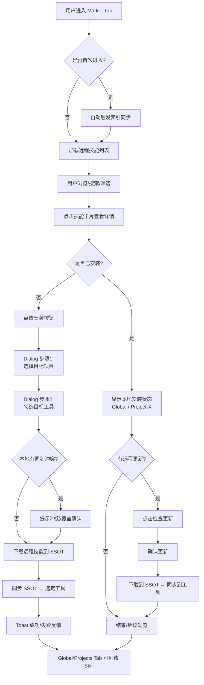

# Skill Manager — 产品需求文档

## 1. 产品概述

Skill Manager 是一款桌面应用，用于统一管理 AI 编码工具（Claude Code、Codex CLI、OpenCode、Gemini CLI、Cline）的 Skill 插件。它作为 Skill 的单一信息源（SSOT），在多个工具之间同步 Skill 文件，解决"同一个 Skill 要手动复制到多个工具目录"的痛点。

**一句话定位**：一处管理，多处生效的 AI Skill 同步中心。

## 2. 目标用户

日常使用多个 AI 编码助手的开发者。他们的典型特征是：同时在 2-5 个 AI 工具之间切换，积累了自己的 Skill 库，但苦于每个工具的 Skill 目录不同，手动同步既繁琐又容易遗漏。

## 3. 核心问题

开发者在多个 AI 编码工具中使用 Skill（基于 SKILL.md 的插件），但每个工具有独立的 Skill 目录（如 `~/.claude/skills/`、`~/.codex/skills/`），导致同一份 Skill 需要手动复制到多个位置。当 Skill 更新时，需要逐一同步，极易遗漏造成版本不一致。

## 4. 范围

当前版本已超出原始 MVP 范围，完成度见 §18 里程碑。核心价值仍为：扫描发现 → 集中展示 → 一键同步，并新增远程市场、应用内更新、引导、健康检查等能力。

**已实现：** 本地路径扫描、Skill 列表展示、启用/禁用控制、SSOT 同步、全局与项目两级管理、冲突检测与裁决、差异预览、变更忽略、远程市场、应用内更新、首次启动引导、Skill 健康检查/Lint、内置 SKILL.md 编辑器、活动日志。

**未实现（计划中）：** 文件系统监听自动同步、时间戳驱动同步 UI、MCP 集成、除 GitHub 外的其他代码托管平台适配。

## 5. 功能需求

### 5.1 工具路径配置

用户可对各 AI 编码工具的 Skill 目录进行增/删/改操作。配置分两级：

**全局路径**：预设各工具的常见默认路径（如 `~/.claude/skills/`），用户可覆盖。

**项目路径**：留空时自动继承全局路径推断（`<项目根目录>/<工具的相对路径>`），用户手动填写则以自定义值为准。

路径变更后立即触发对应范围的重新扫描。

**验收标准：**
- 13+ 个预设工具各自有正确的默认路径
- 用户可修改任意工具的全局路径和项目相对路径
- 修改路径后自动触发扫描，无需手动操作
- 支持自动发现已安装但未注册的工具

### 5.2 路径格式容错

支持以下路径格式并正确解析为绝对路径：`~/.claude/skills/`、`C:\Users\xx\.claude\skills\`、`/home/xx/.claude/skills/`。路径末尾有无斜杠均可。路径不存在时给出明确错误提示而非崩溃。

**验收标准：**
- `~` 正确展开为用户主目录
- Windows 反斜杠和 Unix 正斜杠均正常处理
- 不存在的路径显示红色提示"路径不存在"

### 5.3 递归扫描 SKILL.md

对每个配置的工具路径递归扫描目录树。找到 `SKILL.md` 后解析其 YAML front matter（提取 `name` 和 `description`），SKILL.md 所在的整个目录作为一个 Skill 识别，停止本目录的继续递归。未找到 SKILL.md 的目录继续向下递归。同一路径下重复扫描时，已存在的 Skill 不产生重复记录（以 `source_path` 去重）。同名 Skill 跨工具合并为一条记录，多份安装。

**扫描算法：**
```
function scan(dir):
    if dir contains "SKILL.md":
        parse front matter → {name, description}
        compute content_hash(dir)
        register skill(source_path=dir)
        return  // 不再深入子目录
    for subdir in dir.children:
        if subdir is directory and not hidden:
            scan(subdir)
```

**Content Hash 计算：** 递归遍历目录下所有非隐藏文件（跳过 `local.md`），按相对路径字典序排列，以 `"相对路径\0内容\0"` 格式依次喂给 SHA-256，输出完整哈希字符串，用于全量 diff 展示。

**Core Hash 计算：** 仅对 `SKILL.md` 文件计算 SHA-256，用于冲突检测和核心内容比对。附属文件（assets/、references/ 等）变更不影响 core_hash。

**验收标准：**
- 能正确发现嵌套目录中的 SKILL.md
- 隐藏目录（以 `.` 开头）跳过不扫描
- 解析 front matter 失败的目录跳过并记日志（不崩溃）
- SKILL.md 存在但 front matter 缺少 `name` 字段 → 以目录名作为 fallback name
- 同名 Skill 跨工具合并为一条记录
- content_hash 和 core_hash 能正确检测内容变化
- description 被正确解析并展示

### 5.4 数据库存储

使用 SQLite 嵌入式数据库，5 张核心表，外键约束开启，级联删除。

**ID 哈希方案：** 取目标字符串的 SHA-256，截取前 8 字节，按 little-endian 解析为有符号 64 位 INTEGER。映射表（skill_installations、sync_logs）使用自增 ID。

**数据表：**

`tools`（工具注册表）：存储各 AI 工具的名称和路径配置。ID 为工具名称哈希。

`projects`（项目列表）：用户手动添加的项目。ID 为项目绝对路径哈希。内置全局项目（id=0, name="Global"）。

`skills`（Skill 元数据）：所有发现的 Skill。唯一约束 `(name, project_id)`。包含 `content_hash`、`core_hash`、`ssot_updated_at`、`source_market_id` 等字段。

`skill_installations`（安装关系）：Skill 与工具的多对多关系，通过 project_id 区分全局和项目级。唯一约束 `(skill_id, tool_id, project_id)`。状态为 active/disabled。包含 `installation_synced_at` 字段。

`sync_logs`（同步日志）：每次同步操作记录一条，含方向（to_ssot/from_ssot）、状态（success/failed）、错误信息。

`dismissed_updates`（变更忽略）：记录用户主动忽略的特定工具变更，hash 匹配则不再提示。

`markets`（市场源）：远程 GitHub 仓库配置，含 provider/owner/name/branch/enabled/layout 等字段。

`remote_skills`（远程技能）：市场索引的技能元数据，含 remote_content_hash、remote_core_hash、is_installed 等字段。

`remote_installations`（远程安装关系）：远程技能与项目的安装关系，支持 scope（global/project）和 active 状态。

**验收标准：**
- 应用重启后数据完整可读
- 级联删除正常工作
- ID 哈希计算正确且一致

### 5.5 SSOT 同步与反向同步

SSOT 位于 `~/.agents/skill-manager/ssot/<name>/`，按 `(name, project_id)` 域隔离。全局域为 `~/.agents/skill-manager/ssot/<name>/`，项目域为 `~/.agents/skill-manager/ssot/_p<project_id>/<name>/`。

**同步流程：**
1. 工具目录 → SSOT：扫描发现变化 → 用户点击"同步" → 复制到 SSOT
2. SSOT → 工具目录：从 SSOT 分发到所有启用的工具目录

**反向同步：** 可将 SSOT 内容推送到指定工具目录，覆盖本地更改。

**文件操作规范：**
- 复制用标准库 API，不用 shell 命令
- 替换用临时目录（`.tmp-{进程ID}-{纳秒时间戳}`）+ rename 原子操作
- Symlink 失败时回退到 Copy 并记录日志

**`local.md` 标记机制：** SSOT 目录下保留 `local.md` 标记文件，语义为"此目录由 Skill Manager 管理"。`hash.rs` 和 `diff.rs` 计算 hash 时跳过 `local.md`。

**验收标准：**
- 扫描到变化后 UI 正确标记
- 点击同步后 SSOT 和所有目标工具目录内容一致
- content_hash 同步前后一致
- 反向同步可覆盖工具本地更改

### 5.6 Skill 可视化列表

主界面展示所有已发现的 Skill 列表，支持卡片/列表两种视图。每个 Skill 显示：名称、描述、来源路径、已安装工具数、SSOT 更新时间。每个 Skill 有启用/禁用开关，禁用后不再同步到该工具。列表在扫描完成后自动刷新。支持搜索、排序、筛选。

**验收标准：**
- Skill 卡片正确显示 name、description、来源路径
- 启用/禁用切换立即生效
- 扫描完成后列表自动更新
- 支持搜索和排序

### 5.7 全局与项目两级管理

界面顶部有"全局"和"项目"两个一级 Tab，外加"Market"远程市场 Tab。全局 Tab 管理所有工具的全局 Skill。项目 Tab 左侧显示项目列表（用户手动添加），右侧与全局界面同构。

项目级安装的 Skill 不反向共享到全局或其他项目。项目级与全局的关联体现在工具路径的继承和 Skill 安装的独立性上。

**验收标准：**
- 全局、项目、市场 Tab 切换正常
- 项目可手动添加/删除/编辑
- 项目级 Skill 不影响全局
- 远程市场 Skill 可浏览、安装、同步

### 5.8 操作反馈

所有用户操作（扫描、同步、安装、配置）结束后有明确反馈。成功时显示绿色提示（含数量统计，如"扫描完成，发现 3 个 Skill"），失败时显示红色错误详情。反馈停留至少 3 秒或在消息中心可查。

**验收标准：**
- 每次操作都有视觉反馈
- 成功/失败样式明确区分
- 反馈信息包含具体数据（数量、名称等）

### 5.9 Skill 市场（远程仓库）

从 GitHub 仓库浏览、搜索、一键安装 Skill。内置 5 个默认市场源，支持用户添加自定义仓库。

**核心能力：**
- 市场源管理：增/删/启用/禁用/同步索引
- 技能浏览：卡片网格 + 搜索 + 按市场筛选
- 引导式安装：用户选择目标项目与目标工具，顺序调用下载到 SSOT → 同步到工具
- 批量操作：全部扫描、全部标记已安装、全部取消标记、同步所有已安装
- 更新检测：检查远程仓库 commit 变化，提示可用更新

**验收标准：**
- 内置市场源自动 seeded
- 可浏览、搜索远程技能，引导式安装到指定项目/工具
- 安装前检查本地同名 Skill 冲突，提示用户确认覆盖或跳过
- 支持批量操作

### 5.10 Market 用户体验流程

Market Tab 作为 Global / Projects 之外的第三级管理入口，用户在此完成远程技能的发现、安装与维护。完整流程分为六个阶段：

**（1）进入与初始化**
用户点击顶部 Market Tab 进入。若为首次进入且远程索引未同步，自动静默触发一次索引同步；若网络不可用，显示降级提示"当前离线，仅展示缓存内容"，并提供"重试"按钮。

**（2）浏览与发现**
卡片网格展示所有已同步的远程技能。顶部提供搜索框（按名称/描述过滤）和市场源下拉筛选。每张卡片展示：技能名称、描述、所属市场源、安装状态指示器（未安装 / 已安装-Global / 已安装-Project-X / 有更新）。

**（3）详情查看**
点击卡片展开详情面板，展示完整 description、远程仓库链接、文件结构预览、本地安装状态（已安装到哪些项目/工具）以及远程版本与本地版本的 hash 对比。

**（4）安装决策**
用户点击"安装"按钮，触发引导式 Dialog：
- 步骤 1：选择目标项目（Global / 具体项目）
- 步骤 2：勾选目标工具（多选，默认选中当前项目下所有启用的工具）
- 前置检查：若本地 Global 已有同名 Skill，弹出确认"本地已存在同名 Skill，是否覆盖？"
- 确认后执行：下载远程技能到 SSOT → 同步 SSOT 到选定工具目录
- 完成：Toast 反馈成功/失败，含技能名称与目标项目

**（5）批量操作**
Market 顶部提供批量操作入口：
- 全部同步索引：调用 `sync_all_market_indices` 一次性同步所有 enabled 的市场源索引
- 全部标记已安装：将所有 `remote_skills.is_installed` 设为 true（仅 UI 关注标记，不触发实际同步）
- 全部取消标记：反向操作
- 同步所有已安装：调用 `sync_remote_installations_to_tools` 批量同步所有 active 的远程安装

**（6）更新维护**
远程更新检测有两种触发方式：
- 手动：用户点击"检查更新"按钮
- 自动：进入 Market Tab 时静默检查（仅检查，不自动安装）

检测到更新后，技能卡片显示"有更新"标记。用户点击后展示变更摘要（commit 信息 + 文件 diff 概览），确认后执行更新流程：下载到 SSOT → 同步到工具。

**体验一致性要求**
- 远程安装的技能在 Global / Projects Tab 中正常可见，不隔离展示
- Market 中的安装状态与 `remote_installations` 表保持一致
- `remote_skills.is_installed` 作为 UI 关注标记，不影响实际同步状态

**待确定事项**
以下事项需在开发前明确，当前 PRD 未形成最终决策：

- **（待确定 1）首次进入 Market 是否自动触发索引同步？** §5.10 描述为"自动静默触发"，但 §7 规定"无后台进程、无轮询"。需明确：用户主动切 Tab 触发的同步是否算作"显式操作触发"，还是需要改为手动触发。
- **（待确定 2）`remote_skills.is_installed` 的语义定义。** IPC 命令名为 `set_all_remote_skills_installed`，§5.10 定义为"UI 关注标记"。需明确：该字段是仅影响 UI 展示的标记，还是同时反映实际安装状态？
- **（待确定 3）远程安装的技能是否写入本地 `skills` 表？** §5.10 要求"Global/Projects Tab 可见"，但数据模型存在 `skills` 与 `remote_skills` 两张表。需明确：安装到 SSOT 后，是否同时在本地 `skills` 表创建记录，还是在查询时 union 两张表？
- **（待确定 4）更新远程已安装技能的具体 IPC 路径。** 现有 IPC 只有 `check_remote_updates`（检查）和 `download_remote_skill_to_ssot` + `sync_remote_skill_to_tools`（下载+同步），缺少"执行更新"的专用组合命令。需明确：更新流程由前端组合调用现有 IPC，还是后端提供新的 IPC？
- **（待确定 5）进入 Market Tab 时是否默认自动检查远程更新？** §5.10 描述为"进入时静默检查"，但可能产生频繁网络请求。需明确：默认开启还是关闭？是否在设置中提供开关？
- **（待确定 6）Global 场景下安装 Dialog 的默认工具选中逻辑。** §5.10 写"默认选中当前项目下所有启用的工具"，但 Global 不是项目，"当前项目"概念不适用。需明确：Global 场景下默认选中全部启用工具，还是按其他规则？
- **（待确定 7）批量操作"全部标记已安装"是否同时创建 `remote_installations` 记录？** 该操作目前定义为"仅 UI 关注标记"，但 IPC 命令名暗示可能影响安装状态。需明确：标记是否生成实际的安装关系记录？
- **（待确定 8）远程技能详情页的"文件结构预览"数据来源。** §5.10 描述为"文件结构预览"，但 `remote_skills` 表未存储文件树。需明确：文件结构是否在索引时从远程仓库解析并缓存，还是实时拉取？
- **（待确定 9）离线/网络失败的降级策略细节。** §5.10 提到"当前离线，仅展示缓存内容"，但未定义缓存对象、有效期及重试机制。需明确：缓存内容为 `remote_skills` 表数据？是否设置 TTL？失败后是否自动重试？
- **（待确定 10）搜索范围与数据新鲜度。** §5.10 写"按名称/描述过滤"，但未明确搜索是基于本地索引字段还是实时查询远程。需明确：搜索是否仅针对已同步到 `remote_skills` 表的记录？远程仓库的实时变更如何进入搜索范围？
- **（待确定 11）卡片安装状态指示器的多项目展示规则。** 若同一远程技能在 Global 和多个 Project 中均已安装，卡片上是否展示完整项目列表，还是折叠为"已安装（多项目）"？需明确空间有限时的展示策略。
- **（待确定 12）安装 Dialog 中目标工具的可选范围。** 若用户选择的 Project 下某些工具未配置路径（空路径），Dialog 是否过滤掉该工具、禁用勾选，还是允许安装但跳过同步？需明确边界处理。
- **（待确定 13）批量操作"全部标记已安装"的适用范围。** 该操作是仅作用于当前筛选结果，还是作用于全部 `remote_skills` 记录？需明确交互语义。
- **（待确定 14）更新流程中"文件 diff 概览"的数据来源。** §5.10 描述为"commit 信息 + 文件 diff 概览"，但未明确 diff 是 GitHub commit diff 还是本地 SSOT 与远程的 hash diff。需明确实现路径与性能影响。
- **（待确定 15）远程更新与本地修改的冲突处理。** 若远程技能已安装到 SSOT 且用户在本地修改了该技能，Market 中触发更新时是否先检测本地 hash 差异并提示冲突，还是直接覆盖？需明确与 §5.5 冲突检测的联动规则。
- **（待确定 16）`check_remote_updates` 与 `check_remote_ssot_updates` 的使用场景区分。** IPC 清单中存在两条相似命令，§5.10 未明确各自的触发场景。需明确：前者检查工具目录远程技能更新，后者检查 SSOT 中远程技能更新，还是其他分工？
- **（待确定 17）Market Tab 是否支持"已安装 / 未安装"筛选。** §5.9 只提到"按市场筛选"，§5.10 未补充安装状态筛选。需明确是否提供"仅看已安装"或"仅看未安装"的快捷筛选。
- **（待确定 18）安装 Dialog 是否支持"仅下载到 SSOT，暂不同步到工具"选项。** §5.10 描述为"确认后执行：下载远程技能到 SSOT → 同步 SSOT 到选定工具目录"，两步绑定执行。需明确：是否允许用户选择"仅下载"以延迟同步，还是必须一步完成。
- **（待确定 19）更新流程中，下载到 SSOT 后是否立即自动同步到工具。** §5.10 描述为"确认后执行更新流程：下载到 SSOT → 同步到工具"，但未说明这是自动两步还是用户可干预。需明确：更新到 SSOT 后是否自动同步，还是仅更新 SSOT 等待用户手动同步。
- **（待确定 20）Market Tab 的"检查更新"按钮与"同步索引"按钮的交互关系。** §5.10 区分了"同步索引"（刷新远程技能列表）和"检查更新"（检查远程 commit 变化），但未明确两者的触发条件和 UI 布局。需明确：是否同时存在两个按钮，还是合并为一个"刷新"按钮带下拉选项。
- **（待确定 21）远程技能安装到 SSOT 后，如果在本地修改了该技能，Market 安装状态指示器是否反映"本地已修改"。** §5.10 定义了"未安装 / 已安装-Global / 已安装-Project-X / 有更新"四种状态，但"有更新"仅指远程有更新。需明确：本地修改是否也触发特殊状态标记，还是仅依赖远程更新检测。
- **（待确定 22）详情面板中"远程版本与本地版本的 hash 对比"的展示形式。** §5.10 描述为"hash 对比"，但未明确是仅展示两个 hash 值，还是提供可视化 diff 视图。需明确：展示纯文本 hash 还是可交互的 unified/并排 diff。
- **（待确定 23）批量操作"同步所有已安装"的 scope。** §5.10 描述为"遍历 remote_installations 中 active=true 的记录"，理论上包含所有 Project 和 Global。需明确：批量同步是否默认作用于全部已安装记录，还是提供 scope 筛选（Global / 全部 Project / 当前 Project）。
- **（待确定 24）被禁用的市场源（enabled=false）的技能，在 Market Tab 中是否仍展示。** §5.10 写"卡片网格展示所有已同步的远程技能"，但未明确是否过滤 disabled 的 market 源。需明确：disabled 源的技能是隐藏、置灰，还是仍正常展示。
- **（待确定 25）安装 Dialog 中选择 Project 后，如果该项目下未配置任何工具，Dialog 如何表现。** 待确定 12 已覆盖"空路径工具"的边界处理，但未覆盖"零工具配置"场景。需明确：Dialog 是否禁用"安装"按钮、提示"该项目未配置工具"，还是允许安装但仅写入 SSOT。
- **（待确定 26）安装前的同名冲突检查范围。** §5.10 描述为"若本地 Global 已有同名 Skill"，仅检查 Global。需明确：是否同时检查所有 Project 下的同名 Skill，还是仅检查 Global？如果目标项目已有同名 Skill，是否也触发冲突提示？
- **（待确定 27）下载远程技能到 SSOT 时使用的 SSOT 域（project_id）。** §5.5 规定 SSOT 按 (name, project_id) 域隔离，§5.10 未明确安装到不同项目时对应的 SSOT 路径。需明确：下载到 SSOT 时是否使用目标项目的 project_id 作为域标识。
- **（待确定 28）远程技能更新时，如果已在多个项目（Global + Project）中安装，更新流程作用于所有 SSOT 域还是仅触发更新的域。** §5.10 未说明多项目安装场景下的更新粒度。需明确：更新是全局单次操作，还是按 project_id 分域独立更新。
- **（待确定 29）Mermaid 流程图是否完整反映"进入 Market Tab 时自动检查更新"机制。** §5.10 文字描述包含"自动：进入 Market Tab 时静默检查（仅检查，不自动安装）"，但当前 Mermaid 图未体现该分支。需明确：自动检查更新是否作为独立节点纳入流程图，还是仅作为文字补充说明。
- **（待确定 30）远程技能的卸载/删除流程。** §5.9 / §5.10 仅定义安装、更新、同步，未定义卸载。需明确：用户能否在 Market 中卸载远程技能？卸载是否级联删除 SSOT 和工具目录中的文件？卸载后 Market 中的安装状态如何变化？
- **（待确定 31）同名冲突检查的范围是否包含目标 Project。** §5.10 描述为"若本地 Global 已有同名 Skill"，仅检查 Global。需明确：安装到 Project-X 时，是否同时检查 Project-X 下的同名 Skill？是否检查所有 Project？
- **（待确定 32）内置市场源"seeded"与"索引同步"的关系。** §5.9 写"内置市场源自动 seeded"，§5.10 写"首次进入且远程索引未同步"。需明确：seeded 是否包含初始远程技能索引数据，还是仅 markets 表记录？若包含，首次进入是否仍需同步？
- **（待确定 33）远程安装的技能在 Global / Projects Tab 中的可操作范围。** §5.10 要求"可见"，但未明确是否可执行本地操作（启用/禁用/反向同步/删除）。需明确：远程安装的技能在本地 Tab 中是否与本地 Skill 完全同权。
- **（待确定 34）同一技能同时存在本地安装和远程安装时的展示区分。** 若用户本地已有一个同名 Skill，同时又在 Market 中安装了远程同名 Skill，Market 卡片是否区分"本地来源"和"远程来源"？需明确展示策略。
- **（待确定 35）Mermaid 图节点 L → V 的逻辑严谨性。** 当前图中 L（结束/继续浏览）直接指向 V（Global/Projects Tab 可见），但"未安装的技能"在 Global/Projects Tab 中不可见。需明确：该箭头是否应改为条件分支（已安装 → 可见，未安装 → 不可见），还是仅作为"已安装状态的持续可见"示意。
- **（待确定 36）`scan_all_remote_repositories` 与 `sync_all_market_indices` 的分工。** IPC 清单中存在两条相似命令，§5.10 仅使用后者。需明确：前者是否用于"强制全量扫描/重建索引"，后者用于"增量同步索引"，还是其他分工？
- **（待确定 37）远程技能下载到 SSOT 时是否创建 `local.md`。** §5.5 规定 SSOT 目录下保留 `local.md` 标记文件，但远程技能下载到 SSOT 时是否也创建？如果创建，`local.md` 的内容与本地技能的是否一致？
- **（待确定 38）安装失败后的重试路径。** §5.10 写"Toast 反馈成功/失败"，但未明确失败后用户如何重试。需明确：是否保留 Dialog 状态、提供"重试"按钮，还是需重新触发安装流程。
- **（待确定 39）市场源筛选的交互方式（单选/多选）。** §5.9 写"按市场筛选"，§5.10 写"市场源下拉筛选"。需明确：下拉筛选是单选还是多选？是否支持"全选/反选"？
- **（待确定 40）`remote_core_hash` 的使用场景。** §5.4 数据模型定义了 `remote_core_hash`，但 §5.10 未提到其用途。需明确：该字段是否用于更新检测、核心内容比对，还是仅作为冗余校验？
- **（待确定 41）远程技能安装后是否记录 `source_market_id`。** §5.4 `skills` 表有 `source_market_id` 字段，但 §5.10 未说明安装远程技能后是否设置该字段。需明确：该字段是否用于追溯技能来源？
- **（待确定 42）已安装远程技能在 Market 卡片上的可操作按钮。** §5.10 写"显示本地安装状态"，但未明确已安装的远程技能在 Market 中是否提供"卸载"或"取消安装"操作。需明确：Market 是否承担远程技能的全生命周期管理，还是仅负责发现与安装。
- **（待确定 43）批量操作按钮的可用条件与禁用逻辑。** §5.10 写"Market 顶部提供批量操作入口"，但未明确各按钮的可用条件。需明确：网络不可用时是否禁用"全部同步索引"？无远程安装时是否禁用"同步所有已安装"？
- **（待确定 44）"有更新"标记的交互形态。** §5.10 写"用户点击后展示变更摘要"，但未明确是点击整个卡片还是仅点击"有更新"标记/按钮。需明确：标记是否作为独立可点击元素，还是卡片整体的点击行为。
- **（待确定 45）远程技能在 Market 中的状态集是否包含"已安装但未激活"。** §5.10 状态集只有四种（未安装/已安装-Global/已安装-Project-X/有更新），未覆盖本地禁用场景。需明确：若远程技能在 Global 中被禁用，Market 卡片是否展示为"已安装（未激活）"。
- **（待确定 46）远程技能安装到 SSOT 后，本地修改是否在本地 Tab 的"检查更新"中体现。** §5.10 的"有更新"仅指远程更新，但未说明本地修改的检测责任归属。需明确：本地修改由 Global/Projects Tab 的 `check_updates` 检测，还是由 Market Tab 统一处理。
- **（待确定 47）同一技能在多个市场源中重复出现时的去重策略。** §5.4 数据模型允许同一技能被多个市场源索引，§5.10 未定义 Market Tab 的展示策略。需明确：同一技能在多个市场源中重复出现时，是展示为一张卡片还是多张卡片？如果展示为一张，市场源信息如何展示？
- **（待确定 48）Market Tab 的空态处理规则。** §5.10 定义了"当前离线"的降级提示，但未定义"搜索无结果"、"无远程技能"、"同步失败"等场景的空态展示。需明确各空态下的插画/文案/操作按钮。
- **（待确定 49）远程索引同步过程中 Market Tab 的加载态。** §5.10 描述为"自动静默触发一次索引同步"，但未明确同步过程中的 UI 表现。需明确：是否显示骨架屏、进度条、禁用交互，还是静默后台处理。
- **（待确定 50）详情面板中"本地安装状态"的数据来源。** §5.10 写"本地安装状态（已安装到哪些项目/工具）"，但未明确该数据来自 `remote_installations` 表还是实时查询本地 `skill_installations` 表。需明确数据源和查询时机。
- **（待确定 51）安装 Dialog 的取消/关闭路径。** §5.10 仅定义"确认后执行"的成功路径，但未明确用户点击 Dialog 取消/关闭按钮后的行为。需明确：取消后是否回退到详情面板，是否保留已选择的项目/工具状态。
- **（待确定 52）安装过程中的进度反馈机制。** §5.10 写"Toast 反馈成功/失败"，但未明确下载和同步过程中的中间状态反馈。需明确：是否展示进度条/百分比、分步 Toast（"下载中..."/"同步中..."）、还是仅展示最终结果。
- **（待确定 53）批量操作的二次确认机制。** §5.10 定义四种批量操作，但未明确是否都需要二次确认。需明确：哪些操作需要"确认后执行"，哪些可以立即执行；批量操作失败时是否提供"重试"选项。
- **（待确定 54）远程技能更新时的版本粒度与选择权。** §5.10 写"确认后执行更新流程：下载到 SSOT → 同步到工具"，但未明确更新是自动跳到最新版本，还是允许用户选择特定版本/跳过某些版本。需明确：是否展示版本列表、是否支持"更新到此版本"的选择。
- **（待确定 55）市场源 URL 解析规则（`add_market_by_url`）。** §17.3 存在 `add_market_by_url` 命令，但 §5.10 未定义用户输入 URL 时的解析和校验规则。需明确：支持的 URL 格式（如 `https://github.com/owner/repo`、`https://github.com/owner/repo/tree/branch`）、分支提取逻辑、错误提示文案。
- **（待确定 56）Market Tab 是否支持排序功能。** §5.6 要求"支持搜索、排序、筛选"，但 §5.10 仅定义了搜索和筛选，未明确排序能力。需明确：是否支持按名称/描述/市场源/安装状态/更新时间排序，默认排序规则是什么。
- **（待确定 57）安装 Dialog 中目标工具多选的交互方式。** §5.10 写"勾选目标工具（多选）"，但未明确交互细节。需明确：是否提供"全选/反选"按钮、默认是否全选、工具数量较多时是否支持搜索过滤。
- **（待确定 58）远程技能安装到 SSOT 后，`source_market_id` 在本地 Tab 中是否可见。** 待确定 41 已覆盖"是否记录"，但未覆盖"记录后在本地 Tab 中如何展示"。需明确：Global/Projects Tab 中是否展示"来源市场"信息，还是仅 Market Tab 可见。
- **（待确定 59）远程安装的技能在本地 Tab 中启用/禁用时，是否同步更新 `remote_installations.active`。** §5.10 要求"Market 中的安装状态与 `remote_installations` 表保持一致"，但未明确反向联动规则。需明确：在 Global/Projects Tab 中禁用远程技能时，Market 中的状态是否同步更新为"未激活"。
- **（待确定 60）Market Tab 是否支持按工具类型筛选。** §5.9 写"按市场筛选"，§5.10 写"市场源下拉筛选"，但未提供"按工具筛选"能力。需明确：是否支持"仅显示可在 Claude Code 中安装的技能"等工具维度筛选。
- **（待确定 61）安装 Dialog 中项目/工具选择后的确认步骤设计。** §5.10 写"确认后执行"，但未明确是 Dialog 内直接点击"安装"即确认，还是需要额外二次确认。需明确：是否在 Dialog 底部提供"取消/安装"两个按钮，点击"安装"即触发下载同步。
- **（待确定 62）安装成功后是否自动切换到本地 Tab 或提供跳转入口。** §5.10 写"Global/Projects Tab 可见该 Skill"，但未明确是否自动切换 Tab、高亮该 Skill，还是仅作为后续可手动查看。需明确：安装成功后是否需要引导用户到本地 Tab 验证。
- **（待确定 63）远程技能下载到 SSOT 后是否验证 content_hash。** §5.5 定义 content_hash 用于检测变化，但 §5.10 未明确远程下载后的校验逻辑。需明确：下载完成后是否计算本地 hash 并与远程 hash 对比，不一致时是否提示"下载不完整"。
- **（待确定 64）远程技能列表的性能策略（虚拟滚动/分页/懒加载）。** §5.10 写"卡片网格展示所有已同步的远程技能"，但未明确大量技能（如 1000+）时的性能处理。需明确：是否使用虚拟滚动、分页加载、还是懒加载机制。
- **（待确定 65）Toast 反馈的停留时间。** §5.8 要求"Toast 显示时间 ≥ 3 秒"，但 §5.10 未明确 Market 操作反馈的停留时间。需明确：安装/同步/更新等操作的 Toast 是否遵循 ≥3 秒规则，是否支持手动关闭。
- **（待确定 66）远程技能在本地 Tab 中是否支持内置编辑器编辑。** §5.10 要求"Global/Projects Tab 可见"，但未明确远程安装的技能在本地 Tab 中是否与本地 Skill 享有同等编辑权限。需明确：是否可以在 Global/Projects Tab 中直接编辑远程安装的技能，还是仅允许在 Market 中更新。
- **（待确定 67）远程技能与远程仓库版本的差异预览能力。** §5.10 描述为"hash 对比"，但未明确是否提供与远程仓库当前版本的 unified/并排 diff 预览。需明确：更新前是否展示文件级 diff，还是仅展示 hash 值变化。
- **（待确定 68）远程安装/更新操作的同步日志记录与查看位置。** §5.4 定义了 `sync_logs` 表，但 §5.10 未明确远程安装、远程更新、远程同步到工具等操作是否记录日志，以及用户在哪个界面查看这些日志。需明确：日志是否在 Market Tab 内可见，还是仅 Global/Projects Tab 的日志中体现。
- **（待确定 69）Market Tab 中市场源管理的入口位置与交互方式。** §5.9 定义了市场源 CRUD，但 §5.10 未明确在 Market Tab 中如何触发这些操作。需明确：市场源管理是独立页面/侧边栏，还是通过 Dialog/Modal 实现。
- **（待确定 70）远程技能详情中是否展示 GitHub 元数据（star/fork/last commit）。** §5.10 写"远程仓库链接"，但未明确是否从 GitHub API 获取并展示仓库元数据。需明确：是否展示 star 数、fork 数、最后提交时间等信息，以及这些信息是否在索引时缓存。
- **（待确定 71）远程技能的文件大小与下载预估时间展示。** §5.10 未定义安装前是否向用户展示远程技能的文件大小或预估下载时间。需明确：安装 Dialog 或详情面板是否展示这些信息，以帮助用户决策。
- **（待确定 72）远程技能的许可证（License）信息展示。** §5.10 未明确是否展示远程技能的许可证类型。需明确：详情面板是否展示 License 信息，以及安装时是否需要用户确认接受许可证。
- **（待确定 73）远程技能的"最后更新时间"字段来源与展示。** §5.10 未明确远程技能卡片的"最后更新时间"来自 GitHub 的 last commit 还是远程仓库的 updated_at 字段。需明确：时间字段的来源和展示格式。
- **（待确定 74）本地 Tab 中远程安装的技能的"来源路径"展示规则。** §5.6 要求显示"来源路径"，但远程安装的技能来源为 SSOT，且 SSOT 路径包含 project_id 域。需明确：Global/Projects Tab 中远程技能的来源路径是展示 SSOT 真实路径，还是展示"来自 Market"等语义化标签。
- **（待确定 75）远程技能安装到 SSOT 后，是否参与本地 `content_hash` 计算。** §5.5 规定 content_hash 计算跳过 `local.md`，但未明确远程下载的技能文件是否与本地技能统一参与 hash 计算。需明确：远程技能安装到 SSOT 后，其 content_hash 是否与本地同目录技能的计算规则一致。
- **（待确定 76）Market Tab 的"同步索引"操作是否支持增量/全量切换。** §5.10 写"调用 sync_all_market_indices 一次性同步所有 enabled 的市场源索引"，但未明确该操作是增量同步还是全量重建。需明确：是否提供"增量同步"和"强制全量同步"两种模式，以及切换方式。
- **（待确定 77）远程技能索引失败时的部分展示策略。** 若某个市场源索引同步失败（如网络超时），但其他市场源成功，Market Tab 是否展示成功同步的技能，同时标记失败源的状态。需明确：部分失败时的降级展示规则。
- **（待确定 78）远程技能安装后的"安装时间"记录与展示。** §5.10 未定义是否记录远程技能的安装时间，以及在哪些界面展示。需明确：是否在 Market 卡片、本地 Tab、或详情面板中展示"安装于 X 天前"等信息。
- **（待确定 79）Market Tab 是否支持深色/浅色主题切换。** §5.10 未明确主题切换是否覆盖 Market Tab，还是仅 Global/Projects Tab。需明确：Market Tab 是否遵循全局主题设置。
- **（待确定 80）远程技能安装到 SSOT 后，本地修改的检测触发时机。** §5.10 写"有更新"标记仅指远程更新，但未明确本地修改的检测是在打开本地 Tab 时触发，还是仅在用户主动点击"检查更新"时触发。需明确：本地修改的检测时机与远程更新检测是否分离。
- **（待确定 81）Market Tab 是否支持卡片/列表两种视图切换。** §5.6 要求"支持卡片/列表两种视图"，但 §5.10 仅定义"卡片网格"。需明确：Market Tab 是否遵循相同的视图切换机制，以及列表视图下的展示字段。
- **（待确定 82）市场源管理（CRUD）在 Market Tab 中的具体入口位置。** §5.9 定义了市场源管理能力，但 §5.10 未明确用户在哪里执行这些操作。需明确：是 Market Tab 顶部的下拉菜单、侧边栏、还是独立页面/弹窗。
- **（待确定 83）远程技能的"安装统计"或社区热度展示。** §5.10 未定义是否展示该远程技能的全球安装量、star 数等社区指标。需明确：是否从 GitHub API 获取并展示安装统计或 star 数，以及这些信息是否在索引时缓存。
- **（待确定 84）远程技能的依赖管理。** §5.10 未定义远程技能是否存在依赖关系，以及安装时是否自动安装依赖。需明确：远程技能是否支持依赖声明（如 dependencies 字段），以及依赖的解析和安装策略。
- **（待确定 85）远程技能的兼容性标注与检查。** §5.10 未定义是否展示远程技能支持的工具类型/版本。需明确：远程技能是否标注兼容性（如"仅支持 Claude Code"），以及安装时的兼容性检查规则（如目标工具未配置路径时是否阻止安装）。
- **（待确定 86）Market Tab 的整体布局结构。** §5.10 未明确 Market Tab 的布局层次。需明确：搜索框、市场源筛选器、批量操作按钮、市场源管理入口的具体位置（顶部工具栏/左侧边栏/右侧面板）以及响应式行为。
- **（待确定 87）远程技能详情面板的交互形式。** §5.10 写"点击卡片展开详情面板"，但未明确面板形式。需明确：是侧边滑出面板、底部抽屉、还是跳转到独立详情页；是否支持 Esc 关闭、点击遮罩关闭。
- **（待确定 88）远程技能索引数据的缓存策略与有效期。** §5.10 写"当前离线，仅展示缓存内容"，但未明确缓存数据的有效期和更新策略。需明确：缓存数据是否设置 TTL，是否在每次进入 Market Tab 时尝试静默刷新，还是仅手动触发。
- **（待确定 89）远程源失效后本地副本的行为策略。** §5.10 未定义远程仓库被删除、私有化或失效后，已安装到 SSOT 的本地副本如何处理。需明确：已安装的远程技能在远程源失效后，是否仍可正常使用、同步和更新，还是标记为"源已失效"。
- **（待确定 90）Market Tab 是否支持手动导入远程技能（ZIP 上传或任意 URL 解析）。** §5.9 提到"支持用户添加自定义仓库"，但未明确是否支持直接上传 ZIP 文件或输入非 GitHub URL 解析。需明确：安装远程技能的入口是否仅限市场源索引，还是支持手动导入。
- **（待确定 91）Market 操作是否支持消息中心查询。** §5.8 要求"反馈停留至少 3 秒或在消息中心可查"，但 §5.10 未明确 Market 操作（安装/同步/更新）的反馈是否持久化到消息中心。需明确：Market 操作的 Toast 是否仅临时展示，还是同时写入可查询的消息中心。
- **（待确定 92）远程技能 description 过长时的截断与展开规则。** §5.10 写"每张卡片展示：技能名称、描述"，但未明确 description 超过一定长度时的展示策略。需明确：卡片上是否截断为 N 行并展示"展开"按钮，还是仅展示固定长度省略号。
- **（待确定 93）远程仓库的 branch 选择与切换。** §5.4 `markets` 表包含 `branch` 字段，但 §5.10 未明确用户是否可以切换远程技能的 branch，以及切换后的索引更新策略。需明确：是否支持在 Market 中切换同一仓库的不同 branch，以及切换后是否需要重新同步索引。
- **（待确定 94）远程技能的安装历史与版本回退能力。** §5.10 未定义是否记录远程技能的安装历史（如安装时间、版本号、来源分支），以及是否支持版本回退。需明确：是否在详情面板或 Market 中展示历史版本列表，允许用户回退到旧版本。
- **（待确定 95）Market Tab 是否支持多语言/国际化。** §5.6 提到"主题切换与多语言"，但 §5.10 未明确 Market Tab 的文本（按钮、提示、空态文案）是否跟随全局语言设置。需明确：Market Tab 是否纳入多语言覆盖范围。
- **（待确定 96）首次启动引导是否包含 Market 配置引导。** §5.12 定义了首次启动引导 wizard，但 §5.10 未明确引导流程是否包含 Market 相关步骤（如默认市场源确认、网络权限申请）。需明确：新用户首次启动时是否经历 Market 配置环节。
- **（待确定 97）Skill 健康检查是否覆盖远程安装的技能。** §5.12 定义了健康检查/Lint 能力，但 §5.10 未明确远程安装的技能是否纳入 Lint 检查范围。需明确：Market 中安装的远程技能是否在健康检查中可见，以及检查结果如何展示。
- **（待确定 98）Market Tab 的键盘快捷键与无障碍支持。** §5.10 未定义键盘交互（如 Esc 关闭详情面板、Ctrl+K 聚焦搜索、Tab 键导航）。需明确：是否提供键盘快捷键，以及是否遵循无障碍访问规范。

**用户体验流程图**



### 5.11 应用内更新

检测并下载安装新版本应用。

**核心能力：**
- 检查 GitHub Release 最新版本
- 下载安装包到本地
- 启动安装程序

**验收标准：**
- 可检测新版本
- 支持下载和安装

### 5.12 引导与健康检查

**首次启动引导：** 新用户引导 wizard，帮助配置工具路径和首次扫描。

**Skill 健康检查：** 对 Skill 进行 Lint 检查，发现潜在问题（如 front matter 缺失、路径错误等），支持自动修复。

**内置编辑器：** 直接在应用内编辑 SKILL.md 文件，无需跳转到外部编辑器。

**验收标准：**
- 首次启动显示引导 wizard
- 健康检查可发现常见问题
- 内置编辑器可保存 SKILL.md

## 6. 非功能需求

### 6.1 性能

全量扫描 50 个 Skill（约 10MB）应在 5 秒内完成。哈希计算使用流式处理，避免一次性加载大文件。

### 6.2 稳定性

文件操作失败时不影响其他 Skill 的同步。所有写操作使用临时目录 + rename 原子替换，避免写入中途失败导致数据损坏。

### 6.3 跨平台

支持 Windows、macOS 和 Linux。路径解析需兼容三种系统的格式。

### 6.4 体积

Tauri v2 打包，目标体积 ~5MB，无需额外运行时依赖。

## 7. 同步触发机制

当前不含后台进程、文件系统监听或定时任务（文件监听仍计划中）。同步在以下时机触发：

- **打开主界面**：全量扫描（全局 + 所有项目 + 所有工具路径）
- **"检查更新"按钮**：重新扫描所有已配置路径，对比 content_hash 检测变化
- **全局/项目 Tab 手动刷新**：仅扫描对应范围
- **Market 操作**：安装/更新/同步索引后自动同步到 SSOT/工具
- **安装/卸载/更新操作**：立即同步对应 Skill
- **工具路径变更**：立即触发对应范围扫描
- **冲突解决**：立即同步到保留版本的工具目录

## 8. 技术架构

```
┌─────────────────────────────────────────────────────────────┐
│                        Tauri v2 Desktop                      │
│  ┌───────────────────────────────────────────────────────┐  │
│  │                  React SPA (前端)                       │  │
│  │  - Global / Projects / Market 三 Tab                   │  │
│  │  - 技能卡片/列表视图、搜索、排序                        │  │
│  │  - 工具路径配置、项目管理                                │  │
│  │  - 差异预览、冲突裁决、反向同步                          │  │
│  │  - 市场源管理、安装对话框、批量操作                      │  │
│  │  - 引导向导、健康检查、内置编辑器                        │  │
│  │  - 操作反馈 Toast / Dialog / Modal                      │  │
│  └──────────────────────────┬────────────────────────────┘  │
│                             │ Tauri IPC                     │
│  ┌──────────────────────────▼────────────────────────────┐  │
│  │                  Rust Backend (后端)                     │  │
│  │  - 目录递归扫描 + SKILL.md front matter 解析            │  │
│  │  - SHA-256 content_hash / core_hash 计算               │  │
│  │  - 文件复制 / 原子替换 / symlink                        │  │
│  │  - SQLite 读写 + 迁移                                   │  │
│  │  - LockManager 串行化同步                                │  │
│  │  - LCS diff 算法                                       │  │
│  │  - GitHub 远程市场拉取与索引                            │  │
│  │  - 应用自更新检查与下载                                  │  │
│  └───────────────────────────────────────────────────────┘  │
│                             │                               │
│  ┌──────────────────────────▼────────────────────────────┐  │
│  │                    SQLite 数据库                        │  │
│  │  tools | projects | skills | skill_installations       │  │
│  │  sync_logs | dismissed_updates | markets               │  │
│  │  remote_skills | remote_installations                  │  │
│  └───────────────────────────────────────────────────────┘  │
└─────────────────────────────────────────────────────────────┘
```

## 9. 数据模型

详见 `doc/skill-manager-ddl.sql`。核心实体关系：

- `tools` 1:N `skill_installations`：一个工具下可安装多个 Skill
- `skills` 1:N `skill_installations`：一个 Skill 可安装到多个工具；identity 为 `(name, project_id)`
- `projects` 1:N `skill_installations`：通过 project_id=0 标识全局
- `skills` 1:N `sync_logs`：每个 Skill 的同步历史
- `markets` 1:N `remote_skills`：一个市场源可索引多个远程技能
- `remote_skills` 1:N `remote_installations`：一个远程技能可安装到多个项目

## 10. 约束条件

1. **同步策略**：默认 Copy，可选 Symlink（try-symlink → catch → fallback copy）
2. **无后台进程**：不含 watcher/cron/polling，仅显式操作触发
3. **标准库文件操作**：不用 shell 命令，用 Rust 标准库 API
4. **不操作 lock 文件**：只复制文件，不管工具的 lock 文件
5. **SKILL.md 为最小发现单位**：找到 SKILL.md 后停止递归，复制整个目录

## 11. 未实现功能（计划中）

以下功能已讨论或部分实现，但尚未完全落地：

- 文件系统监听自动同步（M12）
- 时间戳驱动同步 UI（M11 部分完成）
- core_hash 用于更新检测而非仅冲突检测（M9 部分完成）
- MCP 集成：MCP Server 配置管控与跨工具同步
- 除 GitHub 外的其他代码托管平台适配
- 自动检测工作区目录
- 定时检测同步

## 12. 验收检查清单

| # | 功能 | 验收条件 |
|---|------|---------|
| 1 | 工具路径配置 | 13+ 预设工具可修改路径，修改后立即触发扫描 |
| 2 | 路径格式容错 | ~/、C:\、/home/ 三种格式均正确解析 |
| 3 | 递归扫描 | 正确发现 SKILL.md，解析 front matter，name-as-identity |
| 4 | 数据库 | 8+ 张表正常工作，重启数据完整，级联删除正确 |
| 5 | SSOT 同步 | 工具→SSOT→其他工具 同步正常，反向同步可用 |
| 6 | 冲突管理 | 同名 Skill 不同内容时检测冲突，支持 diff 预览和裁决 |
| 7 | 变更忽略 | 可持久化忽略特定工具变更，hash 变化后重新提示 |
| 8 | Skill 列表 | 正确展示所有 Skill，启用/禁用开关生效，支持搜索排序 |
| 9 | 全局/项目/市场 | Tab 切换正常，项目可增删，远程市场可浏览安装 |
| 10 | 操作反馈 | 每次操作有成功/失败提示，包含具体数据 |
| 11 | 应用内更新 | 可检测、下载、安装新版本 |
| 12 | 引导与健康检查 | 首次启动引导正常，Lint 检查可发现问题并修复 |

## 13. 验收用例

### 13.1 工具路径配置

| 输入 | 预期输出 |
|------|---------|
| 修改 Claude Code 全局路径为 `~/my-skills/claude/` | 路径保存成功，自动触发扫描该目录 |
| 将 Codex CLI 项目路径留空 | 推断为 `<项目根>/.codex/skills/` |
| 将 OpenCode 项目路径填为 `.custom/skills/` | 使用自定义路径覆盖推断 |
| 删除 Gemini CLI 工具 | 对应 skill_installations 和 sync_logs 级联删除 |

### 13.2 路径格式容错

| 输入 | 预期输出 |
|------|---------|
| `~/.claude/skills/` | 展开为 `C:\Users\xxx\.claude\skills\`（Windows）或 `/home/xxx/.claude/skills/`（Linux） |
| `C:\Users\xx\.claude\skills` （无尾斜杠） | 自动补尾斜杠，正常使用 |
| `/home/xx/.claude/skills/` （Windows 上输入 Unix 路径） | 检测到路径不存在，显示"路径不存在"提示 |
| `\\server\share\skills\` （UNC 路径） | 正常解析使用 |
| `./relative/path` | 拒绝，提示"请输入绝对路径" |

### 13.3 递归扫描

| 输入场景 | 预期输出 |
|---------|---------|
| `~/.claude/skills/` 下有 `skill-a/SKILL.md` | 发现 skill-a，name 取 front matter |
| `skills/nested/deep/skill-b/SKILL.md` | 递归找到 skill-b |
| `skills/.hidden/SKILL.md` | 跳过，不扫描隐藏目录 |
| `skills/broken/SKILL.md`（front matter 格式错误） | 跳过，记日志"解析失败" |
| `skills/no-name/SKILL.md`（front matter 缺 name） | 以目录名 `no-name` 作为 name |
| 同一目录扫描第二次 | 不产生重复记录（source_path 去重） |
| `skills/skill-a/sub/SKILL.md`（嵌套 SKILL.md） | 只识别 skill-a（父目录命中后停止递归） |

### 13.4 SSOT 同步与反向同步

| 输入场景 | 预期输出 |
|---------|---------|
| 扫描发现 tool-A 下的 skill-x content_hash 变了 | UI 标记 skill-x "有更新" |
| 点击"同步" skill-x | 复制到 SSOT → 广播到其他启用工具 |
| 点击"反向同步" skill-x | SSOT 覆盖指定工具目录 |
| 同步完成后检查各目录 content_hash | 全部一致 |
| 同步过程中目标目录写入失败 | 该 Skill 标记失败，其他 Skill 不受影响，sync_logs 记一条 failed |

### 13.5 全局与项目管理

| 输入场景 | 预期输出 |
|---------|---------|
| 添加项目路径 `D:\my-project` | 项目列表新增一项，扫描该项目下的工具路径 |
| 添加已存在的项目路径 | 弹窗拒绝"项目已存在" |
| 删除项目 | 对应 skill_installations 和 sync_logs 级联删除 |
| 项目 Tab 中安装 Skill | 仅该项目可见，不影响全局和其他项目 |

## 14. 路径解析边界情况

### 14.1 支持的格式

| 格式 | 示例 | 处理方式 |
|------|------|---------|
| Tilde 展开 | `~/.claude/skills/` | 替换 `~` 为 `$HOME` / `$USERPROFILE` |
| Windows 绝对路径 | `C:\Users\xx\skills\` | 直接使用 |
| Unix 绝对路径 | `/home/xx/skills/` | 直接使用 |
| UNC 路径 | `\\server\share\skills\` | 直接使用（Windows only） |
| 无尾斜杠 | `~/.claude/skills` | 自动补 `/` 或 `\` |

### 14.2 不支持的格式

| 格式 | 处理方式 |
|------|---------|
| 相对路径 `./skills/` | 拒绝，提示"请输入绝对路径" |
| 环境变量 `%APPDATA%\skills\` | 不展开，提示"不支持环境变量，请输入完整路径" |
| 中文/Unicode 路径 `C:\用户\技能\` | 正常支持（Rust String 为 UTF-8） |

### 14.3 符号链接

扫描时**跟随**符号链接（Rust `fs::read_dir` 默认行为），但不将符号链接本身作为 Skill 的 source_path。如果 Skill 目录是符号链接，SSOT 存储使用解析后的真实路径。

## 15. 错误处理策略

### 15.1 文件操作错误

| 操作 | 失败场景 | 处理方式 |
|------|---------|---------|
| 扫描目录 | 目录不存在 | 跳过该工具路径，UI 显示"路径不存在: xxx" |
| 扫描目录 | 权限不足 | 跳过该目录，UI 显示"权限不足: xxx" |
| 读取 SKILL.md | 文件不存在 | 跳过（理论上不会发生，scan 已确认存在） |
| 解析 front matter | YAML 格式错误 | 跳过该 Skill，记 sync_log(failed) |
| 复制到 SSOT | 磁盘空间不足 | 回滚（删除临时目录），UI 显示"磁盘空间不足" |
| 复制到 SSOT | 目标目录锁定 | 回滚，UI 显示"目标文件被占用，请关闭相关程序后重试" |
| rename 原子替换 | 跨卷操作 | 回退为 copy + delete（非原子），失败则回滚 |
| 创建符号链接 | 开发者模式未启用 | 回退到 Copy，记日志"symlink 失败，回退到 copy" |

### 15.2 数据库错误

| 失败场景 | 处理方式 |
|---------|---------|
| 数据库文件损坏 | 启动时检测，提示"数据库损坏，是否重置？"，重置后重新扫描 |
| ID 哈希冲突 | 极小概率事件，冲突时在 UI 显示警告，保留旧记录 |
| 写入失败 | 事务回滚，UI 显示错误信息，不破坏现有数据 |

### 15.3 错误恢复原则

- **单个 Skill 失败不影响其他 Skill**：批量操作中跳过失败项，继续处理剩余项
- **所有写操作可回滚**：先写临时目录，rename 成功后才算完成，失败则删除临时目录
- **错误信息具体可操作**：不显示"未知错误"，而是给出具体原因和建议操作

## 16. UI 交互规范

### 16.1 状态流转

```
应用启动
  │
  ├── 数据库不存在 → 初始化 DB + seed data → 首次全量扫描
  │
  └── 数据库存在 → 加载数据 → 全量扫描（检测变化）
                        │
                        ├── 无变化 → 显示当前 Skill 列表
                        │
                        └── 有变化 → 标记"有更新" → 等待用户操作
                                          │
                                          ├── 点击"同步" → 同步 → 更新列表
                                          └── 忽略 → 保持标记
```

### 16.2 加载态

| 场景 | 展示 |
|------|------|
| 全量扫描中 | Skill 列表区域显示骨架屏（Skeleton），顶部进度条 |
| 同步单个 Skill | 该 Skill 卡片显示旋转加载图标 |
| 添加项目 | 按钮显示 loading 态，禁止重复点击 |

### 16.3 空态

| 场景 | 展示 |
|------|------|
| 首次启动无 Skill | 居中插图 + "尚未发现 Skill，请配置工具路径后扫描" |
| 项目下无 Skill | "该项目下暂无 Skill" + 扫描按钮 |
| 搜索无结果 | "未找到匹配的 Skill" |

### 16.4 操作反馈

| 操作 | 成功反馈 | 失败反馈 |
|------|---------|---------|
| 扫描完成 | Toast: "扫描完成，发现 N 个 Skill" | Toast: "扫描失败: [具体原因]" |
| 同步完成 | Toast: "同步成功，N 个 Skill 已更新" | Toast: "同步失败: [具体原因]" |
| 启用/禁用 | Toggle 即时切换，无 Toast | - |
| 添加项目 | Toast: "项目已添加" | Dialog: "路径无效/已存在" |
| 修改路径 | Toast: "路径已更新，正在重新扫描" | Toast: "路径无效: [原因]" |
| 安装远程 Skill | Toast: "已安装 xxx 到 yyy" | Toast: "安装失败: [具体原因]" |
| 检查更新 | Updates Modal / Toast | Toast: "检查更新失败: [具体原因]" |

Toast 显示时间 ≥ 3 秒，支持手动关闭。

## 17. 技术方案评审

### 17.1 技术栈可行性评估

**Tauri v2 + React + SQLite** 组合成熟度足够：

- **Tauri v2**：2024 年 10 月发布 v2 正式版，支持 Windows/macOS/Linux/移动端。Rust 后端提供原生文件系统和进程操作能力，打包体积 ~5MB。
- **React**：与 Tauri v2 的前端绑定无关（任何 JS 框架均可），React 生态成熟，组件库丰富。
- **SQLite**：Tauri 生态有两种集成路径（见 §17.2），无论哪种都经过社区验证。
- **风险点**：Tauri v2 的 Rust 异步运行时（tokio）与 SQLite 的同步 API 需要适配，rusqlite 需用 `spawn_blocking` 包裹。

### 17.2 SQLite 集成方案对比

| 维度 | tauri-plugin-sql | rusqlite (Rust 直连) |
|------|-----------------|---------------------|
| 访问方式 | 前端 JS 直接调 SQL | Rust 后端操作，通过 Tauri Command 暴露给前端 |
| 异步支持 | 原生 async/await | 需 `spawn_blocking` 包裹同步 API |
| 事务控制 | 有限（plugin 层面封装） | 完全控制（BEGIN/COMMIT/ROLLBACK） |
| Migration | 内置 Migration 机制 | 手动管理或自建 |
| 适合场景 | 简单 CRUD、前端直连 | 复杂查询、批量操作、扫描后批量写入 |
| 本项目适用性 | ⚠️ 扫描+哈希+复制+DB写入在 Rust 侧完成，前端直连 SQL 反而增加复杂度 | ✅ Rust 后端统一处理文件操作和数据库写入，事务控制更灵活 |

**决策：采用 rusqlite**。理由：本项目的核心逻辑（目录扫描、哈希计算、文件复制、DB 写入）全部在 Rust 后端完成，使用 rusqlite 可以直接在同一个函数中完成"扫描→写 DB"的事务性操作，无需跨进程通信。前端只通过 Tauri Command 获取处理后的结果。

### 17.3 Tauri IPC 接口清单

Rust 后端通过 `#[tauri::command]` 暴露以下接口给 React 前端：

#### 工具管理

| Command | 参数 | 返回 | 说明 |
|---------|------|------|------|
| `list_tools` | - | `Vec<Tool>` | 获取所有工具列表 |
| `update_tool_path` | `tool_id, global_path, project_rel_path` | `Result<()>` | 修改工具路径，触发重新扫描 |
| `add_tool` | `name, global_path, project_rel_path` | `Result<Tool>` | 添加自定义工具 |
| `delete_tool` | `tool_id` | `Result<()>` | 删除工具（级联删除） |

#### 项目管理

| Command | 参数 | 返回 | 说明 |
|---------|------|------|------|
| `list_projects` | - | `Vec<Project>` | 获取所有项目 |
| `add_project` | `name, path` | `Result<Project>` | 添加项目，触发扫描 |
| `update_project` | `project_id, name, path` | `Result<()>` | 修改项目名称和路径 |
| `delete_project` | `project_id` | `Result<()>` | 删除项目（级联删除） |

#### Skill 管理

| Command | 参数 | 返回 | 说明 |
|---------|------|------|------|
| `list_skills` | `project_id` | `Vec<SkillView>` | 获取 Skill 列表（含安装状态） |
| `toggle_skill` | `skill_id, tool_id, project_id, active` | `Result<()>` | 启用/禁用 Skill |
| `sync_skill` | `skill_id, project_id, source_path?` | `Result<SyncResult>` | 手动同步（source_path 指定变更来源） |
| `sync_all_pending` | - | `Vec<SyncResult>` | 同步所有待同步的 Skill |
| `reverse_sync_skill` | `skill_id, tool_id, project_id` | `Result<SyncResult>` | 反向同步：SSOT → 指定工具目录 |
| `check_updates` | `project_id` | `Vec<SkillUpdate>` | 检查所有 Skill 更新 |
| `check_skill_update` | `skill_id, project_id` | `Vec<SkillUpdate>` | 检查单个 Skill 更新 |
| `get_skill_diff` | `skill_id, source_path?` | `SkillDiff` | 获取 diff（source_path 指定对比来源） |
| `dismiss_skill_update` | `skill_id, tool_id, current_hash` | `Result<()>` | 忽略某工具的变更 |
| `list_conflicts` | `project_id` | `Vec<ConflictView>` | 获取未解决冲突列表 |
| `resolve_conflict` | `conflict_id, keep_tool_name, project_id` | `Result<SyncResult>` | 裁决冲突（保留指定版本） |
| `lint_skills` | `project_id` | `Vec<SkillLint>` | 批量健康检查 |
| `lint_skill` | `skill_id, project_id` | `SkillLint` | 单个 Skill 健康检查 |
| `fix_skill` | `skill_id, project_id` | `SkillLint` | 自动修复 Skill 问题 |
| `read_skill_md` | `skill_id, project_id` | `SkillFile` | 读取 SKILL.md 内容 |
| `save_skill_md` | `skill_id, project_id, content` | `SyncResult` | 保存 SKILL.md 内容 |

#### 扫描与同步

| Command | 参数 | 返回 | 说明 |
|---------|------|------|------|
| `full_scan` | - | `ScanResult` | 全量扫描（打开主界面时调用） |
| `scan_scope` | `project_id?, tool_id?` | `ScanResult` | 按范围扫描（刷新按钮） |
| `sync_all_pending` | - | `Vec<SyncResult>` | 同步所有待同步的 Skill |

#### 同步日志

| Command | 参数 | 返回 | 说明 |
|---------|------|------|------|
| `get_sync_logs` | `skill_id, limit` | `Vec<SyncLog>` | 查询同步日志 |

#### 远程市场

| Command | 参数 | 返回 | 说明 |
|---------|------|------|------|
| `list_markets` | - | `Vec<Market>` | 获取市场源列表 |
| `add_market` | `provider, owner, name, branch` | `Market` | 添加市场源 |
| `add_market_by_url` | `url, branch?, layout?` | `Market` | 通过 URL 添加市场源 |
| `update_market` | `id, provider, owner, name, branch, enabled, layout?` | `Market` | 更新市场源 |
| `delete_market` | `id` | `Result<()>` | 删除市场源 |
| `sync_market_index` | `market_id` | `MarketSyncResult` | 同步单个市场索引 |
| `sync_all_market_indices` | - | `Vec<MarketSyncResult>` | 同步所有市场索引 |
| `scan_all_remote_repositories` | - | `Vec<MarketSyncResult>` | 扫描所有远程仓库 |
| `list_remote_skills` | `market_id?` | `Vec<RemoteSkill>` | 获取远程技能列表 |
| `download_remote_skill_to_ssot` | `remote_skill_id` | `SyncResult` | 下载远程技能到 SSOT |
| `sync_remote_skill_to_tools` | `remote_skill_id, project_id, tool_path` | `SyncResult` | 同步远程技能到工具 |
| `sync_remote_installations_to_tools` | `project_id, market_id?, tool_path` | `SyncResult` | 批量同步远程安装到工具 |
| `toggle_remote_installation` | `remote_skill_id, project_id, scope, active` | `RemoteInstallation` | 切换远程安装状态 |
| `sync_remote_installations` | `project_id, market_id?` | `SyncResult` | 同步所有远程安装 |
| `check_remote_updates` | `market_id?, market_filter?` | `Vec<RemoteSkillUpdate>` | 检查远程更新 |
| `check_remote_ssot_updates` | `market_id?, market_filter?` | `Vec<RemoteSkillUpdate>` | 检查 SSOT 远程更新 |
| `set_all_remote_skills_installed` | `project_id, market_id?, active` | `RemoteSkillInstalledResult` | 批量设置远程技能安装状态 |
| `list_remote_installations` | `project_id, market_id?` | `Vec<RemoteInstallation>` | 获取远程安装列表 |
| `check_market_commits` | - | `Vec<MarketCommitUpdate>` | 检查市场 commit 更新 |

#### 应用自更新

| Command | 参数 | 返回 | 说明 |
|---------|------|------|------|
| `check_app_update` | - | `AppUpdateInfo` | 检查应用更新 |
| `download_app_update` | `url, file_name` | `String` | 下载更新包 |
| `install_app_update` | `installer_path` | `Result<()>` | 安装更新 |

#### 设置

| Command | 参数 | 返回 | 说明 |
|---------|------|------|------|
| `get_settings` | - | `Settings` | 获取应用设置 |
| `update_settings` | `Settings` | `Result<()>` | 更新设置（含同步模式切换） |

### 17.4 跨平台文件操作策略

| 操作 | Rust 实现 | 跨平台注意 |
|------|----------|-----------|
| 递归扫描 | `std::fs::read_dir` + 递归 | 隐藏文件判断：Unix 检查 `.` 前缀，Windows 检查 `FILE_ATTRIBUTE_HIDDEN` |
| 路径展开 `~` | `dirs::home_dir()` crate | 三平台均支持 |
| 复制目录 | `std::fs::copy` 逐文件 | 保持权限位（Unix `chmod`），Windows 忽略 |
| 原子替换 | 写临时目录 → `std::fs::rename` | Windows 上 rename 跨卷失败 → 回退 copy+delete |
| Symlink | `std::os::windows::fs::symlink_dir` / `std::os::unix::fs::symlink` | Windows 需开发者模式或管理员权限，失败回退 copy |
| 路径规范化 | 统一用 `PathBuf`，输出时按平台转分隔符 | - |

### 17.5 关键依赖

| Crate | 用途 | 版本要求 |
|-------|------|---------|
| `tauri` | 桌面框架 | ^2.0 |
| `tauri-plugin-opener` | 打开外部链接 | ^2.0 |
| `rusqlite` | SQLite 操作 | ^0.31（bundled feature） |
| `serde` / `serde_json` | 序列化 | ^1.0 |
| `sha2` | SHA-256 哈希 | ^0.10 |
| `dirs` | 平台目录（home, config 等） | ^5.0 |
| `serde_yaml` | YAML front matter 解析 | ^0.9 |
| `tokio` | 异步运行时（Tauri 自带） | ^1.0 |
| `log` / `env_logger` | 日志 | ^0.4 |
| `reqwest` / `zip` | 远程市场 ZIP 下载与解压 | - |

## 18. 开发里程碑

### 18.1 依赖关系图

```
[数据库初始化] ──→ [工具路径配置] ──→ [递归扫描] ──→ [Skill 列表展示]
                                                            │
                                                            ├──→ [启用/禁用]
                                                            │
                                                            ├──→ [冲突检测] ──→ [冲突裁决]
                                                            │
                                                            └──→ [SSOT 同步] ──→ [检查更新]
                                                                                │
[项目管理] ─────────────────────────────────────────────────────────────────────┘
     │
     └──→ [操作反馈] (贯穿全程)

[远程市场] ──→ [安装到 SSOT] ──→ [同步到工具]
     │
     └──→ [更新检测] ──→ [远程更新同步]
```

### 18.2 里程碑定义

#### M1：基础能力（可独立验证）

**目标**：应用能启动、配置路径、扫描发现 Skill 并展示列表。

| 功能 | PRD 章节 |
|------|---------|
| Tauri v2 项目脚手架 + React 前端骨架 | §8 |
| SQLite 初始化 + seed data | §5.4 |
| 工具路径配置（CRUD） | §5.1, §5.2 |
| 递归扫描 SKILL.md | §5.3 |
| Skill 列表展示 | §5.6 |
| 全局 Tab 基本 UI | §5.7 |

**验证标准**：启动应用 → 看到 13+ 预设工具 → 修改路径 → 点击扫描 → 看到 Skill 列表。

**预估工作量**：S（3-5 天）

#### M2：核心同步（可独立验证）

**目标**：Skill 可以在多个工具目录之间同步，支持启用/禁用。

| 功能 | PRD 章节 |
|------|---------|
| SSOT 目录创建（`~/.agents/skill-manager/ssot/`） | §5.5 |
| 同步（工具 → SSOT → 其他工具） | §5.5 |
| 反向同步（SSOT → 指定工具目录） | §5.5 |
| `local.md` 标记机制 | §5.5 |
| 启用/禁用 Skill | §5.6 |
| "检查更新"按钮 | §7 |
| 文件操作规范（copy/rename/symlink） | §5.5, §10 |
| LockManager 串行化 | §5.5 |

**验证标准**：创建一个本地 Skill → 同步到多个工具目录 → 修改其中一个 → 重新扫描检测到变化 → 点击同步 → 各目录一致。

**预估工作量**：M（5-8 天）

#### M3：完善体验（可独立验证）

**目标**：项目管理、操作反馈、错误处理、差异预览、冲突管理全部就绪。

| 功能 | PRD 章节 |
|------|---------|
| 项目管理（添加/删除/编辑） | §5.7 |
| 项目级 Skill 隔离 | §5.7 |
| 操作反馈（Toast/Dialog/Modal） | §5.8, §16 |
| 错误处理（所有边界情况） | §15 |
| 加载态 / 空态 UI | §16.2, §16.3 |
| 同步日志查看 | §5.4 |
| 差异预览（unified / 并排） | §5.3 |
| 冲突检测与裁决 | §5.4 |
| 变更忽略 | §5.4 |
| 路径格式容错全量测试 | §14 |

**验证标准**：完整走一遍 §13 验收用例全部通过。

**预估工作量**：M（5-8 天）

#### M4：远程市场（可独立验证）

**目标**：支持从 GitHub 仓库浏览、搜索、安装 Skill。

| 功能 | PRD 章节 |
|------|---------|
| 市场源管理（增/删/启用/禁用） | §5.9 |
| 远程仓库索引与扫描 | §5.9 |
| 技能卡片浏览与搜索 | §5.9 |
| 一键安装到 SSOT + 工具 | §5.9 |
| 批量操作（sync-all / mark-all） | §5.9 |
| 远程更新检测 | §5.9 |

**验证标准**：添加市场源 → 同步索引 → 浏览技能 → 一键安装 → 检查更新。

**预估工作量**：L（8-13 天）

#### M5：体验提升（可独立验证）

**目标**：应用内更新、引导、健康检查、编辑器等体验功能落地。

| 功能 | PRD 章节 |
|------|---------|
| 应用内更新（检测/下载/安装） | §5.11 |
| 首次启动引导 wizard | §5.12 |
| Skill 健康检查 / Lint | §5.12 |
| 内置 SKILL.md 编辑器 | §5.12 |
| 主题切换与多语言 | §5.6 |
| 活动日志面板 | §5.4 |

**验证标准**：新用户首次启动走完引导 → 检查更新可用 → 健康检查可发现问题 → 编辑器可保存。

**预估工作量**：M（5-8 天）

### 18.3 技术风险与关键路径

**关键路径**：M1 数据库 → M1 扫描 → M2 同步 → M3 完善 → M4 远程市场

| 风险 | 概率 | 影响 | 缓解措施 |
|------|------|------|---------|
| rusqlite + tokio `spawn_blocking` 性能 | 低 | 中 | 50 个 Skill 扫描 <5s 足够，不需要极致并发 |
| Windows symlink 权限 | 中 | 低 | 默认 Copy，Symlink 为可选功能，失败回退 |
| rename 跨卷失败 | 低 | 中 | 检测同卷再 rename，否则 copy+delete |
| YAML front matter 解析不稳定 | 低 | 低 | 解析失败跳过，不阻塞扫描 |
| Tauri v2 IPC 大量数据传输 | 低 | 中 | Skill 列表通常 <100 条，无需分页 |
| 远程仓库 ZIP 下载与解析 | 中 | 中 | 添加超时、重试、错误提示；网络失败不影响本地功能 |

### 18.4 总工作量估算

| 里程碑 | 预估 | 累计 |
|--------|------|------|
| M1 基础能力 | S（3-5 天） | 3-5 天 |
| M2 核心同步 | M（5-8 天） | 8-13 天 |
| M3 完善体验 | M（5-8 天） | 13-21 天 |
| M4 远程市场 | L（8-13 天） | 21-34 天 |
| M5 体验提升 | M（5-8 天） | 26-42 天 |
| **总计** | | **4-6 周** |

## 附录 A：术语表

| 术语 | 说明 |
|------|------|
| Skill | 基于 SKILL.md 文件的 AI 编码助手插件，包含 YAML front matter（name + description）和附属文件 |
| SSOT | Single Source of Truth，单一信息源。本应用中指 `~/.agents/skill-manager/ssot/` 目录 |
| content_hash | Skill 目录的全量文件 SHA-256 哈希（跳过 local.md），用于检测内容变化和 diff 展示 |
| core_hash | 仅 SKILL.md 文件的 SHA-256 哈希，用于冲突检测和核心内容比对 |
| ID 哈希 | SHA-256 前 8 字节按 little-endian 解析的有符号 64 位整数，用作数据库主键 |
| front matter | SKILL.md 文件头部的 YAML 元数据块（`---` 包裹），包含 name 和 description |
| 全局 | 与特定项目无关的操作范围，对应 projects 表中 id=0 的内置项目 |
| 项目 | 用户手动添加的开发项目，有独立的路径和 Skill 配置 |
| 工具 | 支持 Skill 的 AI 编码助手（Claude Code、Codex CLI、Cursor、Windsurf 等 13+） |
| 双向同步 | 工具目录 → SSOT → 其他工具目录的同步 |
| 反向同步 | SSOT → 指定工具目录的同步，覆盖本地更改 |
| 名字即身份 | 同名 Skill 跨工具合并为一条记录，多份安装，数据库唯一约束为 `(name, project_id)` |
| local.md | SSOT 目录下的标记文件，语义为"此目录由 Skill Manager 管理"，hash 计算时跳过 |
| Tauri Command | Tauri v2 的 IPC 机制，Rust 后端通过 `#[tauri::command]` 暴露函数给前端 |
| LockManager |  per-skill 锁管理器，串行化同一 Skill 的同步/检测操作，防止并发冲突 |
| Market | 远程 GitHub 仓库市场源，支持浏览、搜索、安装远程 Skill |
| RemoteSkill | 从远程市场索引的技能，有 remote_content_hash 和 remote_core_hash |

## 附录 B：参考资料

- 设计讨论文档：`doc/design-discussion.md`
- 数据库 DDL：`doc/skill-manager-ddl.sql`
- 演进记录与待办：`doc/phase-3.md`
- Tauri v2 官方文档：https://v2.tauri.app/
- rusqlite 文档：https://docs.rs/rusqlite/
- CC Switch 项目：远程拉取 Skill 的参考实现

## 附录 C：PRD 变更日志

| 日期 | 版本 | 变更内容 |
|------|------|---------|
| 2026-06-26 | v0.1 | 初稿：§1-12（产品概述、功能需求、非功能需求、架构、约束、后置功能） |
| 2026-06-26 | v0.2 | Phase 1 差距修复：§5.3 边界情况、§5.5 SSOT 结构 + local.md 机制、§5.7 继承描述、§7 触发入口 |
| 2026-06-26 | v0.3 | Phase 2 补全：§13 验收用例、§14 路径边界、§15 错误处理、§16 UI 交互 |
| 2026-06-26 | v0.4 | Phase 3 技术评审：§17 技术栈评估、IPC 接口清单、SQLite 选型、跨平台策略 |
| 2026-06-26 | v0.5 | Phase 4 里程碑：§18 依赖图、3 个里程碑、风险评估、工作量估算 |
| 2026-06-26 | v1.0 | Phase 5 定稿：补充附录 A 术语表、B 参考资料、C 变更日志 |
| 2026-08-17 | v1.1 | 全面更新以反映实际实现：SSOT 路径修正、name-as-identity、core_hash、远程市场、应用内更新、引导、Lint、编辑器、新增里程碑 M4/M5、更新 IPC 清单、更新术语表 |
